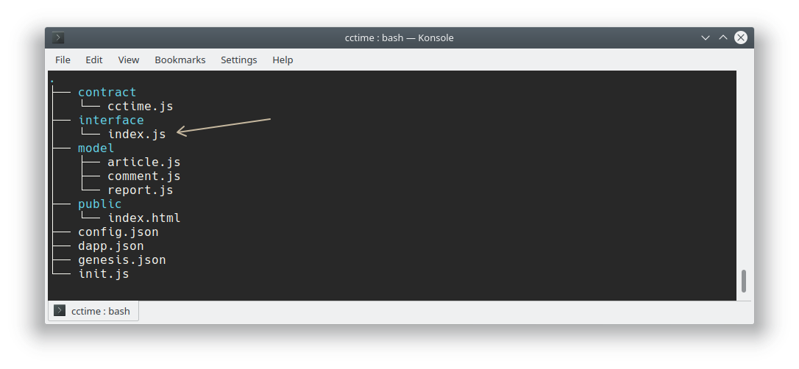

Table of Contents
=================


<!-- TOC -->

- [Asch Dapp Default API](#asch-dapp-default-api)
  - [**1 Blocks**](#1-blocks)
    - [**1.1 Get the Dapp Block Height**](#11-get-the-dapp-block-height)
    - [**1.2 Get Dapp Block Data**](#12-get-dapp-block-data)
  - [**2 Accounts**](#2-accounts)
    - [**2.1 Get Information to a Single Account**](#21-get-information-to-a-single-account)
  - [**3 Transactions**](#3-transactions)
    - [**3.1 Signature**](#31-signature)
      - [**3.1.1 Client signed transaction - more secure**](#311-client-signed-transaction---more-secure)
        - [**3.1.1.1 Dapp Recharge**](#3111-dapp-recharge)
        - [**3.1.1.2 Dapp Withdraw Money, Type=2**](#3112-dapp-withdraw-money-type2)
        - [**3.1.1.2 Dapp Internal Transfer,Type=3**](#3112-dapp-internal-transfertype3)
        - [**3.1.1.2 Dapp set a Nickname, Type=4**](#3112-dapp-set-a-nickname-type4)
      - [**3.1.2 Server Side Signed Transaction (unsigned)**](#312-server-side-signed-transaction-unsigned)
        - [**3.1.2.1 Dapp recharge**](#3121-dapp-recharge)
        - [**3.1.2.2 Dapp Withdraw money, Type=2**](#3122-dapp-withdraw-money-type2)
        - [**3.1.2.2 Dapp Internal Transfer, Type=3**](#3122-dapp-internal-transfer-type3)
        - [**3.1.2.2 set a dapp nickname, type=4**](#3122-set-a-dapp-nickname-type4)
    - [**3.2 Get unconfirmed transactions**](#32-get-unconfirmed-transactions)
    - [**3.3 Get already confirmed transactions**](#33-get-already-confirmed-transactions)
    - [**3.4 Get transaction details for one transaction by id**](#34-get-transaction-details-for-one-transaction-by-id)
    - [**3.5 Obtain dapp transfer records**](#35-obtain-dapp-transfer-records)
  - [**4 Smart Contract**](#4-smart-contract)
    - [**4.1 Get all smart contracts for one Dapp**](#41-get-all-smart-contracts-for-one-dapp)
    - [**4.2 Access Custom Dapp Interface**](#42-access-custom-dapp-interface)

<!-- /TOC -->


# Asch Dapp Default API

This documents describes the default API that every Dapp inherits from the asch-sandbox.

## **1 Blocks**
### **1.1 Get the Dapp Block Height**  
__API Endpoint:__ /api/dapps/dappID/blocks/height  
__HTTP Header:__ GET  
__Supported Format:__ urlencode  

Return Parameter:

|Name	  |Type   |Description       |
|------ |-----  |----              |
|success|boolean|Was the operation successful |
|height |integer|Dapp Block Height |

Javscript Request:
```js
const axios = require('axios')

let dappId = 'bebe3c57d76a5bbe3954bd7cb4b9e381e8a1ba3c78e183478b4f98b9d532f024'
let url = `http://localhost:4096/api/dapps/${dappId}/blocks/height`

axios.get(url)
  .then((response) => {
    console.log(JSON.stringify(response.data))
  })
  .catch((error) => {
    console.log(error.message)
  })
```

Bash Request:  
```bash
curl -k -H "Content-Type: application/json" -X GET http://localhost:4096/api/dapps/bebe3c57d76a5bbe3954bd7cb4b9e381e8a1ba3c78e183478b4f98b9d532f024/blocks/height && echo
```

JSON Response
```json
{
  "height": 10,
  "success": true
}
```


### **1.2 Get Dapp Block Data**
__API Endpoint:__ /api/dapps/dappID/blocks  
__HTTP Header:__ GET  
__Supported Format:__ urlencode  
__Endpoint Description:__ Get all blocks from the Dapp  

Request Parameters:

|Name	  |Type   |Required |Description              |   
|------ |-----  |---  |----              |   
|limit |integer |No    |Limit the number of results, Minimum: 0, Maximum: 100  |   
|orderBy|string  |No      |Sort by a field of the table, e.g. height:desc (sorts after height descending)  |   
|offset|integer  |No     |Offset, Minimum: 0 |   
|generatorPublicKey|string  |No      |The public key of the generator (delegate) of this block.  |   
|totalAmount|integer  |No       |Total amount of transactions, Minimum: 0, Maximum: 10000000000000000 |   
|totalFee|integer  |No      |Total fee, Minimum: 0，Maximum: 10000000000000000  |   
|previousBlock|string  |No      |Previous Block  |   
|height|integer  |No      |Block height  |    

Return Parameter:

|Name	|Type   |Description   |   
|------ |-----  |----              |   
|success|boolean  |Was the request successful?     |   
|count|integer   |The total number of blocks that met the query condition|   
|blocks|Array  |Each element of the returned array carries the data of one block, like id, height and other information|
        

Javascript Request:
```js
const axios = require('axios')

let parameters = {
  params: {
    limit: 1
  }
}

let dappId = 'bebe3c57d76a5bbe3954bd7cb4b9e381e8a1ba3c78e183478b4f98b9d532f024'
let url = `http://localhost:4096/api/dapps/${dappId}/blocks`

axios.get(url, parameters)
  .then((response) => {
    console.log(JSON.stringify(response.data))
  })
  .catch((error) => {
    console.log(error.message)
  })
```

Bash Request:  
```bash
curl -k -H "Content-Type: application/json" -X GET http://localhost:4096/api/dapps/bebe3c57d76a5bbe3954bd7cb4b9e381e8a1ba3c78e183478b4f98b9d532f024/blocks?limit=1 && echo
```

JSON Response:
```json
{
  "blocks": [{
    "id": "451dd17f273ea5fbd240238178c1343b11031a1d309ee8b29e8b1a5838473ec6",
    "timestamp": 0,
    "height": 1,
    "payloadLength": 103,
    "payloadHash": "995f4749e1924af55f1cdefd202efd0b37b2aa70553982378c037bc6015d5634",
    "prevBlockId": "",
    "pointId": "",
    "pointHeight": 0,
    "delegate": "8065a105c785a08757727fded3a06f8f312e73ad40f1f3502e0232ea42e67efd",
    "signature": "b1d0171494ce6c0621902c6005f7a85e15f3509a68ac6106b166abf711ced73efaeaf1eae0cdf594143854e27b417b253485cf98b3cc9f7aa967a929b717020b",
    "count": 1
  }],
  "count": 133,
  "success": true
}
```

## **2 Accounts**
### **2.1 Get Information to a Single Account** 
__API Endpoint:__ /api/dapps/dappID/accounts/:address  
__HTTP Header:__ GET  
__Supported Format:__ urlencode  

Request Parameter:  
  
|Name   |Type   |Required   |Description   |
|------ |-----  |---        |----          |
|address |string|Yes        |Asch Address|
  
Return Parameter: 

|Name   |Type   |Description   |
|------ |-----  |----              |
|success|boolean  |Was the request successful?     |
|account|json  |All information regarding one account such as: Asset balances, is the address a delegate? and other information|
  

Javascript Request:
```js
const axios = require('axios')

let address = 'ANH2RUADqXs6HPbPEZXv4qM8DZfoj4Ry3M'

let dappId = 'bebe3c57d76a5bbe3954bd7cb4b9e381e8a1ba3c78e183478b4f98b9d532f024'
let url = `http://localhost:4096/api/dapps/${dappId}/accounts/${address}`

axios.get(url)
  .then((response) => {
    console.log(JSON.stringify(response.data))
  })
  .catch((error) => {
    console.log(error.message)
  })
```
  
Bash Request:  
```bash
curl -k -H "Content-Type: application/json" -X GET http://localhost:4096/api/dapps/bebe3c57d76a5bbe3954bd7cb4b9e381e8a1ba3c78e183478b4f98b9d532f024/accounts/ANH2RUADqXs6HPbPEZXv4qM8DZfoj4Ry3M && echo   
```

JSON Response:
```js
{
  "success": true,
  "account": {
    "balances": [{
      "currency": "XAS", // this account has a XAS balance (either through a recharge or an internal dapp transfer)
      "balance": "10000000000"  // 100 XAS
    }],
    "extra": null,
    "isDelegate": false // is not a delegate
  }
}
```


## **3 Transactions**  
### **3.1 Signature**
The HTTP Endpoint is divided into ___signed___ und ___unsigned___. Either will the transaction be signed locally and then send to the server (signed) or the secret must be send to the server and there the transaction will be signed (unsigned).

#### **3.1.1 Client signed transaction - more secure**
Peer related API, you need to set the a header at a request.

 - key is magic:
    - testnet: 594fe0f3
    - mainnet: 5f5b3cf5
 - key version is '' (empty)

All write operations in Asch start with a transaction.  
The transaction data is created through a library called [asch-js](https://github.com/AschPlatform/asch-js) and then published via a POST interface.
The HTTP-POST API specification are as follows:

|Matter   |Description  |
|---    |---   |
|API Endpoint|/peer/transactions  |
|payload|transaction data that were created with `asch-js`|
|HTTP Method|post/put etc.|
|Supported format|json |
  
##### **3.1.1.1 Dapp Recharge**  
__API Endpoint:__ /peer/transactions  
__HTTP Header:__ POST   
__Supported Format:__ json   
Note: When the recharge occurs in the main chain (mainchain-transaction-type 6, intransfer) then the Dapp will automatically call the dapp smart contract number 1 for a dapp internal recharge.  

Info:  
A Dapp Recharge is necessary if you want to spend XAS or an other currency in the Dapp. If you have 2000 XAS on your mainchain account that doesn't mean that you can spend 2000 XAS in the Dapp. You have to first "recharge" the Dapp with money. You send some XAS to the Dapp and the balance will be credited on your Dapp account.

Request Parameter:

|Name   |Type   |Required   |Description   |
|------ |-----  |---  |----              |
|transaction|json|Yes|A transaction generated with a function call to `aschJS.transfer.createInTransfer` |

  
Return Parameter:  

|Name   |Type   |Description   |
|------ |-----  |----              |
|success|boolean  |Was the request successful?     |
|transactionId|string  |Transaction id|
  
Javascript Request:
```js
// this account must have enough XAS on the mainchain
const aschJS = require('asch-js')
const axios = require('axios')

let dappid = "bebe3c57d76a5bbe3954bd7cb4b9e381e8a1ba3c78e183478b4f98b9d532f024"
let secret = 'found knife gather faith wrestle private various fame cover response security predict'

let currency = 'XAS'
let amount = 500 * 1e8
let transaction = aschJS.transfer.createInTransfer(dappid, currency, amount, secret, secondSecret || undefined)

let data = {
  transaction: transaction
}

let headers = {
  headers: {
    magic: '594fe0f3',
    version: ''
  }
}

let url = 'http://localhost:4096/peer/transactions'

axios.post(url, data, headers)
  .then((response) => {
    console.log(JSON.stringify(response.data))
  })
  .catch((error) => {
    console.log(error.message)
  })


```

Bash Request
```bash
curl -H "Content-Type: application/json" -H "magic:594fe0f3" -H "version:''" -k -X POST -d '{"transaction":{"type":6,"amount":1000000000,"fee":10000000,"recipientId":null,"senderPublicKey":"2856bdb3ed4c9b34fd2bba277ffd063a00f703113224c88c076c0c58310dbec4","timestamp":39721503,"asset":{"inTransfer":{"dappId":"bebe3c57d76a5bbe3954bd7cb4b9e381e8a1ba3c78e183478b4f98b9d532f024","currency":"XAS"}},"signature":"8cefc8fa933e4d5e8699828dc8cd5d1b4737ffa82175c744fd681bad0b1a6b68526e0783e85d7979f894fc38850bd2ed0a983ce3cb3f5d16b68fd37dfb9dfb0a","id":"4b580f8f61f4586920a4c0d37b6fad21daf3453fe9ccc5426c2cae7a263c160c"}}' http://localhost:4096/peer/transactions && echo    
```

JSON Response:
```js
{
  "success": true,
  "transactionId": "4b580f8f61f4586920a4c0d37b6fad21daf3453fe9ccc5426c2cae7a263c160c"
}
```

##### **3.1.1.2 Dapp Withdraw Money, Type=2**
__API Endpoint:__ /api/dapps/dappID/transactions/signed  
__HTTP Header:__ PUT  
__Supported Format:__ json

Info:  
This operation is the opposite to [**3.1.1.1 Dapp Recharge**](#3111-dapp-recharge). This operation withdraws money from the Dapp to the mainchain.


Request Parameter:

|Name   |Type   |Required   |Description   |
|------ |-----  |---  |----              |
|dappID|string|Yes|Dapp Id|
|transaction|json|Yes|Transaction data generated by a function call to `aschJS.dapp.createInnerTransaction`|


Return Parameter:  

|Name   |Type   |Description   |
|------ |-----  |----              |
|success|boolean  |Was the request successful?     |
|transactionId|string  |Transaction Id|


Example:
```js
// you need at least 1 CCTime.XCT on your sidechain account
const aschJS = require('asch-js')
const axios = require('axios')

let fee = String(0.1 * 100000000)
let type = 2 // withdraw money to mainchain
let options = {
  fee: fee,
  type: type,
  args: JSON.stringify(['CCTime.XCT', '100000000'])
}
let secret = "elite brush pave enable history risk ankle shrimp debate witness ski trend"
let transaction = aschJS.dapp.createInnerTransaction(options, secret)

let dappId = 'b12906bcb8de449e8d41fada9227f1cde206daca17f9bc366666c206ad4d7e20'

let url = `http://localhost:4096/api/dapps/${dappId}/transactions/signed`
let data = {
  transaction: transaction
}
let headers = {
  magic: '594fe0f3',
  version: ''
}

axios.put(url, data, headers)
  .then((response) => {
    console.log(JSON.stringify(response.data))
  })
  .catch((error) => {
    console.log(error.message)
  })
```

Bash Request:  
```bash
# The Money withdraw transaction (type=2) is send to the server
curl -H "Content-Type: application/json" -H "magic:594fe0f3" -H "version:''" -k -X PUT -d '{"transaction":{"fee":"10000000","timestamp":40384202,"senderPublicKey":"aa4e4ac1336a1e9db1ee5ce537a59d3fcb0f068cb4b25aac9f48e0e8bc6259c9","type":2,"args":"[\"CCTime.XCT\", \"100000000\"]","signature":"05dba744705fd1dbc1854b415392364cdbae11778671be8eb5fdbce57855a87b3dde5bf2d0219059411253fb304497758422c8d1546ec45eb5521b4a6577d507"}}' http://localhost:4096/api/dapps/d352263c517195a8b612260971c7af869edca305bb64b471686323817e57b2c1/transactions/signed && echo
```

JSON Response:
```js
{
  "success": true,    
  "transactionId": "8bcae742206bf236214b9972efaca0bbe29f3703b4055a14cc8b095546880dc4"    
}
```

##### **3.1.1.2 Dapp Internal Transfer,Type=3**
__API Endpoint:__ /api/dapps/dappID/transactions/signed  
__HTTP Header:__ PUT  
__Supported Format:__ JSON  

Info:  
This operation transfers money (XAS or other currencies) only between Dapp accounts.

Request Parameter:  
  
|Name   |Type   |Required   |Description   |
|------ |-----  |---  |----              |
|dappID|string|Yes|Dapp Id|
|transaction|json|Yes|Transaction data generated by a function call to `aschJS.dapp.createInnerTransaction`|


Return Parameter: 

|Name   |Type   |Description   |
|------ |-----  |----              |
|success|boolean  |Was the request successful?|
|transactionId|string  |Internal Transfer Transaction Id|

Example:
```js
// you need at least 1 CCTime.XCT on your sidechain account
const aschJS = require('asch-js')
const axios = require('axios')

let fee = String(0.1 * 1e8)
let type = 3 // internal transfer
let options = {
  fee: fee,
  type: type,
  args: JSON.stringify(['CCTime.XCT', '100000000', 'A6H9rawJ7qvE2rKwQfdtBHdeYVehB8gFzC'])
}
let secret = 'elite brush pave enable history risk ankle shrimp debate witness ski trend'
let transaction = aschJS.dapp.createInnerTransaction(options, secret)

let dappId = 'd352263c517195a8b612260971c7af869edca305bb64b471686323817e57b2c1'
let url = `http://localhost:4096/api/dapps/${dappId}/transactions/signed`
let data = {
  transaction: transaction
}
let headers = {
  magic: '594fe0f3',
  version: ''
}

axios.put(url, data, headers)
  .then((response) => {
    console.log(JSON.stringify(response.data))
  })
  .catch((error) => {
     console.log(error.message)
  })
```

Bash Response:
```bash
curl -H "Content-Type: application/json" -H "magic:594fe0f3" -H "version:''" -k -X PUT -d '{"transaction":{"fee":"10000000","timestamp":40387708,"senderPublicKey":"aa4e4ac1336a1e9db1ee5ce537a59d3fcb0f068cb4b25aac9f48e0e8bc6259c9","type":3,"args":"[\"CCTime.XCT\", \"100000000\", \"A6H9rawJ7qvE2rKwQfdtBHdeYVehB8gFzC\"]","signature":"e2364534b8c4b0735a85c68ba17fddf5321fc48af04d483ad05531d4993058eaa35ff44d913a03b6d7278890ff7f42435f8313e08ce70c523dfc256b4de9e303"}}'  http://localhost:4096/api/dapps/d352263c517195a8b612260971c7af869edca305bb64b471686323817e57b2c1/transactions/signed && echo    
```

JSON Response:
```json
{
  "success": true,
  "transactionId": "e2687a471ac2ddbbdd919266e58b0b652c55f74402b27be850d767fa44162c79"
}
```

##### **3.1.1.2 Dapp set a Nickname, Type=4**
__API Endpoint:__ /api/dapps/dappID/transactions/signed  
__HTTP Header:__ PUT  
__Supported Format:__ json  

Request Parameter:  
  
|Name   |Type   |Required   |Description   |
|------ |-----  |---  |----              |
|dappID|string|Yes|Dapp Id|
|transaction|json|Yes|Transaction data generated by a function call to `aschJS.dapp.createInnerTransaction`|

  
Return Parameter:  

|Name   |Type   |Description   |   
|------ |-----  |----              |   
|success|boolean  |Was the request successful?     |   
|transactionId|string  |The TransactionId for the set nickname operation|   
  
Javascript Example:  
```js
const aschJS = require('asch-js')
const axios = require('axios')

let fee = String(0.1 * 1e8)
let type = 4 // set nickname
let options = {
  fee: fee,
  type: type,
  args: JSON.stringify(['Nickname'])
}

let secret = 'elite brush pave enable history risk ankle shrimp debate witness ski trend'
let transaction = aschJS.dapp.createInnerTransaction(options, secret)

let dappId = 'd352263c517195a8b612260971c7af869edca305bb64b471686323817e57b2c1'
let url = `http://localhost:4096/api/dapps/${dappId}/transactions/signed`
let data = {
  transaction: transaction
}
let headers = {
  magic: '594fe0f3',
  version: ''
}

axios.put(url, data, headers)
  .then((response) => {
    console.log(JSON.stringify(response.data))
  })
  .catch((error) => {
    console.log(error.message)
  })
```
Bash Request:
```bash
curl -H "Content-Type: application/json" -H "magic:594fe0f3" -H "version:''" -k -X PUT -d '{"transaction":{"fee":"10000000","timestamp":40388287,"senderPublicKey":"aa4e4ac1336a1e9db1ee5ce537a59d3fcb0f068cb4b25aac9f48e0e8bc6259c9","type":4,"args":"[\"Nickname\"]","signature":"be08cdb2f4d1a0f2f2e5b02e33e67fdf43e403703ce35cb42a2dc7338c7a352adca56dc61e3be0fedc1727c1adc0101f1a9e1a3e67ac0623602bf872deb80802"}}' http://localhost:4096/api/dapps/d352263c517195a8b612260971c7af869edca305bb64b471686323817e57b2c1/transactions/signed && echo    
```

JSON Response:  
```json
{
  "success": true,
  "transactionId": "7teae742206bf236214b9972efaca0bbe29f3703b4055a14cc8b095546880dc4"
}
```

#### **3.1.2 Server Side Signed Transaction (unsigned)**
##### **3.1.2.1 Dapp recharge**
##### **3.1.2.2 Dapp Withdraw money, Type=2**
__API Endpoint:__ /api/dapps/dappId/transactions/unsigned  
__HTTP Header:__ PUT  
__Supported Format:__ JSON  

Info:  
This operation is the opposite to the `Dapp recharge`. This operation withdraws money from the Dapp to the mainchain.

Request Parameter:  
  
|Name   |Type   |Required   |Description   |   
|------ |-----  |---  |----              |   
|secret|string|Yes|Asch secret|  
|fee|string|Yes|Transaction fee, currently fixed at 10000000  |  
|type|integer|Yes|Smart contract type |  
|args|string Array|Yes|The string Array must contain the contract type|


Return Parameter: 

|Name   |Type   |Description   |   
|------ |-----  |----              |   
|success|boolean  |Was the request successful?     |   
|transactionId|string  |Withdrawal transaction Id   |   

Example:
```js
const axios = require('axios')

let headers = {
  magic: '594fe0f3',
  version: ''
}

let dappId = 'd352263c517195a8b612260971c7af869edca305bb64b471686323817e57b2c1'
let url = `http://localhost:4096/api/dapps/${dappId}/transactions/unsigned`

let data = {
  secret: 'elite brush pave enable history risk ankle shrimp debate witness ski trend',
  fee: '10000000',
  type: 2, // withdraw money to mainchain
  args: JSON.stringify(['CCTime.XCT', '100000000'])
}

axios.put(url, data, headers)
  .then((result) => {
    console.log(JSON.stringify(result.data))
  })
  .catch((error) => {
    console.log(error.message)
  })
```

```bash
curl -H "Content-Type: application/json" -H "magic:594fe0f3" -H "version:''" -k -X PUT -d  '{"secret":"elite brush pave enable history risk ankle shrimp debate witness ski trend","fee":"10000000","type":2,"args":"[\"CCTime.XCT\",\"100000000\"]"}' 'http://localhost:4096/api/dapps/d352263c517195a8b612260971c7af869edca305bb64b471686323817e57b2c1/transactions/unsigned' && echo

```
JSON Response:  
```json
{
  "success": true,
  "transactionId": "f59d365cbc8ea29f5d3798af795dc66dbdda00e2f1ae6677d5c7239180f3e98a"
}
```

##### **3.1.2.2 Dapp Internal Transfer, Type=3**  
__API Endpoint:__ /api/dapps/dappId/transactions/unsigned  
__HTTP Header:__ PUT  
__Supported Format:__ JSON  

Info: See [**3.1.1.2 Dapp Internal Transfer,Type=3**](#3112-dapp-internal-transfertype3)

Request Parameter:  
  
|Name   |Type   |Required   |Description   |
|------ |-----  |---  |----              |
|secret|string|Yes|Asch secret |
|fee|string|Yes|  |
|type|integer|Yes|The number of the smart contract |
|args|string array|Yes|The corresponding contract number needs to be passed in |


Return Parameter:  

|Name   |Type   |Description   |
|------ |-----  |----              |
|success|boolean  |Was the request successful?     |
|transactionId|string  |Internal transfer transacation Id|

Javascript Request:
```js
const axios = require('axios')

let headers = {
  magic: '594fe0f3',
  version: ''
}

let data = {
  secret: 'elite brush pave enable history risk ankle shrimp debate witness ski trend',
  fee: '10000000',
  type: 3, // internal transfer
  args: JSON.stringify(['CCTime.XCT', '1000000000', 'ADimyhJa99XFzVrbnTYsCqPB4TKQNdjCWw'])
}

let dappId = 'd352263c517195a8b612260971c7af869edca305bb64b471686323817e57b2c1'
let url = `http://localhost:4096/api/dapps/${dappId}/transactions/unsigned`

axios.put(url, data, headers)
  .then((result) => {
    console.log(JSON.stringify(result.data))
  })
  .catch((error) => {
    console.log(error.message)
  })
```

Bash Request:
```bash
curl -H "Content-Type: application/json" -H "magic:594fe0f3" -H "version:''" -k -X PUT -d  '{"secret":"elite brush pave enable history risk ankle shrimp debate witness ski trend","fee":"10000000","type":3,"args":"[\"CCTime.XCT\",\"1000000000\",\"ADimyhJa99XFzVrbnTYsCqPB4TKQNdjCWw\"]"}' 'http://localhost:4096/api/dapps/d352263c517195a8b612260971c7af869edca305bb64b471686323817e57b2c1/transactions/unsigned' && echo   
```

JSON Response:
```json
{
  "success": true,
  "transactionId": "96d886b7d724e6a00cc8c52c24b674ec8a9fc7fd8145a326bf69983fdc74a006"
}
```

##### **3.1.2.2 set a dapp nickname, type=4**  
__API Endpoint:__ /api/dapps/dappId/transactions/unsigned  
__HTTP Header:__ PUT  
__Supported Format:__ JSON  

Request Parameter:  
  
|Name   |Type   |Required   |Description   |
|------ |-----  |---  |----              |
|secret|string|Yes|asch password |
|fee|string|Yes|Transaction fee, currently 10000000|
|type|integer|Yes|Smart contract number |
|args|string array|Yes|Pass the nickname as a string in an array, see further below for example |

  
Return Parameter: 

|Name   |Type   |Description   |   
|------ |-----  |----              |   
|success|boolean  |Was the request successful?|   
|transactionId|string  |Set nickname transaction id|   
  
Javascript Request:  
```js
const axios = require('axios')

let headers = {
  magic: '594fe0f3',
  version: ''
}

let data = {
  secret: 'minor borrow display rebel depart core buzz right distance avocado immense push',
  fee: '10000000',
  type: 4, // set nickname
  args: JSON.stringify(['zhenxi'])
}

let dappId = 'd352263c517195a8b612260971c7af869edca305bb64b471686323817e57b2c1'
let url = `http://localhost:4096/api/dapps/${dappId}/transactions/unsigned`

axios.put(url, data, headers)
  .then((response) => {
    console.log(JSON.stringify(response.data))
  })
  .catch((error) => {
    console.log(error.message)
  })
```

Bash Request:  
```bash
curl -H "Content-Type: application/json" -H "magic:594fe0f3" -H "version:''" -k -X PUT -d  '{"secret":"minor borrow display rebel depart core buzz right distance avocado immense push","fee":"10000000","type":4,"args":"[\"zhenxi\"]"}' 'http://localhost:4096/api/dapps/d352263c517195a8b612260971c7af869edca305bb64b471686323817e57b2c1/transactions/unsigned' && echo  
```

JSON Response:  
```json
{
  "success": true,    
  "transactionId": "7b5d9d13cf718ee28efde6bae85fbefbcd0eca3d6c0c6fff1421a1102d730669"    
}
```

### **3.2 Get unconfirmed transactions** 
__API Endpoint:__ /api/dapps/dappID/transactions/unconfirmed  
__HTTP Header:__ GET   
__Supported Format:__ urlencode   

Return Parameter:  

|Name   |Type   |Description   |   
|------ |-----  |----              |   
|success|boolean  |Was the request successful?     |   
|transactions|array  |A list of unconfirmed transactions|


Javascript Example:
```js
const axios = require('axios')

let dappId = 'bebe3c57d76a5bbe3954bd7cb4b9e381e8a1ba3c78e183478b4f98b9d532f024'
let url = `http://localhost:4096/api/dapps/${dappId}/transactions/unconfirmed`

axios.get(url)
  .then((response) => {
    console.log(JSON.stringify(response.data))
  })
  .catch((error) => {
    console.log(error.message)
  })
```

Bash Example:  
```bash
curl -k -X GET http://localhost:4096/api/dapps/bebe3c57d76a5bbe3954bd7cb4b9e381e8a1ba3c78e183478b4f98b9d532f024/transactions/unconfirmed && echo
```

JSON Response:
```json
{
  "transactions": [],
  "success": true
}
```

### **3.3 Get already confirmed transactions** 
__API Endpoint:__ /api/dapps/dappID/transactions  
__HTTP Header:__ GET  
__Supported Format:__ urlencode  

Request Parameter:  
  
|Name   |Type   |Required   |Description   |
|------ |-----  |---  |----              |
|senderId |string |No|Address of sender |
|type |interger |No|contract number |
|limit |interger |No|Limit the result set, default is 100|
|offset |interger |No|Offset |


Return Parameter:  

|Name   |Type   |Description   |
|------ |-----  |----              |
|success|boolean  |Was the request successful?|
|transactions|array  |List of confirmed transactions|
|count|integer  |The total number of transactions that met the query conditions|


Javascript Request:
```js
const axios = require('axios')

const parameters = {
  params: {
    senderId: 'AJTGR8EGsprrF7r63D2XLDftGAKUu1Ucjn'
  }
}

let dappId = 'bebe3c57d76a5bbe3954bd7cb4b9e381e8a1ba3c78e183478b4f98b9d532f024'
let url = `http://localhost:4096/api/dapps/${dappId}/transactions`

axios.get(url, parameters)
  .then((response) => {
    console.log(JSON.stringify(response.data))
  })
  .catch((error) => {
    console.log(error.message)
  })
```

Bash Request:  
```bash
curl -k -X GET http://localhost:4096/api/dapps/bebe3c57d76a5bbe3954bd7cb4b9e381e8a1ba3c78e183478b4f98b9d532f024/transactions?senderId=AJTGR8EGsprrF7r63D2XLDftGAKUu1Ucjn && echo   
```

JSON Response:
```json
{
  "count": 1,
  "success": true,
  "transactions": [{
      "id": "b12b144b3dbb76b70cd62f97e3d3b0606d97c0f402bba1fb973dd2d3ab604a16",
      "timestamp": 0,
      "senderId": "AJTGR8EGsprrF7r63D2XLDftGAKUu1Ucjn",
      "senderPublicKey": "27823f51a3dddd475943fb8142380d2f8722b0f6c651f6ac37930b63666c7803",
      "fee": "0",
      "signature": "22739bb762ff0135a0c4199507e3c45a8615c467bfeb4efa5110802033959698588e39b76d037445e02959ee67b483ac4d24f12304181f4955871cdcd28e3001",
      "type": 3,
      "args": "[\"CNY\",\"100000000000000\",\"A8QCwz5Vs77UGX9YqBg9kJ6AZmsXQBC8vj\"]",
      "height": 1
  }]
}
```

### **3.4 Get transaction details for one transaction by id** 
__API Endpoint:__ /api/dapps/dappID/transactions/:id  
__HTTP Header:__ GET  
__Supported Format:__ urlencode  

Request Parameter:  

|Name   |Type   |Required   |Description   |
|------ |-----  |---  |----              |
|id |string |Yes|Transaction Id|

Return Parameter:  

|Name   |Type   |Description|
|------ |-----  |----              |
|success|boolean  |Was the request successful?|
|transaction|object  |The requested transaction|
  

Javascript Request:  

```js
const axios = require('axios')

let transactionId = '7088c67edd43326276453b833727677df6f312271b824564a6a934371265f0dc'

let dappId = 'bebe3c57d76a5bbe3954bd7cb4b9e381e8a1ba3c78e183478b4f98b9d532f024'
let url = `http://localhost:4096/api/dapps/${dappId}/transactions/${transactionId}`

axios.get(url)
  .then((response) => {
    console.log(JSON.stringify(response.data))
  })
  .catch((error) => {
    console.log(error.message)
  })
```

Bash Request:  

```bash
curl -k -X GET http://localhost:4096/api/dapps/bebe3c57d76a5bbe3954bd7cb4b9e381e8a1ba3c78e183478b4f98b9d532f024/transactions/7088c67edd43326276453b833727677df6f312271b824564a6a934371265f0dc && echo     
```

JSON Response:
```json
{
  "success": true,
  "transaction": {
    "id": "7088c67edd43326276453b833727677df6f312271b824564a6a934371265f0dc",
    "timestamp": 39709980,
    "senderId": "ADYGpYHmgkbukqByZ2JzwFXZM6wYfMXCaR",
    "senderPublicKey": "55ad778a8ff0ce4c25cb7a45735c9e55cf1daca110cfddee30e789cb07c8c9f3",
    "fee": "0",
    "signature": "bd51295c3373da2a92c77b6a96a0edbda75cdcde5fd7824ff326c366ed0ec5778e1d02e7d9c280a219d6c815d9bfdbc2d03bb960a0f5d8d35458e4bda87d6104",
    "type": 1,
    "args": "[\"XAS\",\"10000000000\",\"2f1db0014483ffef85289e086af321e374944668dd7fb4f156c70609276ed903\",\"ANH2RUADqXs6HPbPEZXv4qM8DZfoj4Ry3M\"]",
    "height": 637
  }
}
```

### **3.5 Obtain dapp transfer records**
__API Endpoint:__ /api/dapps/dappID/transfers  
__HTTP Header:__ GET  
__Supported Format:__ urlencode  

Info:  
Get the records of sended or received transfers.

Request Parameter:  
  
|Name   |Type   |Required   |Description   |
|------ |-----  |---  |----              |
|ownerId |string |No|At least one of the following have to exists: Sender-Address, OwnerId, Currency|
|currency |string |No|At least one of the following have to exist: Token name, OwnerId, Currency|
|limit |interger |No|Limits the return list, default is 10|
|offset |interger |No|Offset, default 0|

Return Parameter: 

|Name   |Type   |Description|
|------ |-----  |----              |
|success|boolean|Was the request successful?|
|transfers|array|Get the transfers that met the query|
|count|integer|The total number of transfers that met the query conditions|

Javascript Request:
```js
const axios = require('axios')

let dappId = 'bebe3c57d76a5bbe3954bd7cb4b9e381e8a1ba3c78e183478b4f98b9d532f024'
let url = `http://localhost:4096/api/dapps/${dappId}/transfers`

let parameters = {
  ownerid: 'ADYGpYHmgkbukqByZ2JzwFXZM6wYfMXCaR'
}

axios.get(url, parameters)
  .then((response) => {
    console.log(JSON.stringify(response.data))
  })
  .catch((error) => {
    console.log(error.message)
  })
```

Bash Request:
```bash
curl -k -X GET http://localhost:4096/api/dapps/bebe3c57d76a5bbe3954bd7cb4b9e381e8a1ba3c78e183478b4f98b9d532f024/transfers?ownerid=ADYGpYHmgkbukqByZ2JzwFXZM6wYfMXCaR && echo
```

JSON Response:  
```json
{
  "success": true,
  "count": 1,
  "transfers": [{
    "tid": "b12b144b3dbb76b70cd62f97e3d3b0606d97c0f402bba1fb973dd2d3ab604a16",
    "senderId": "AJTGR8EGsprrF7r63D2XLDftGAKUu1Ucjn",
    "recipientId": "A8QCwz5Vs77UGX9YqBg9kJ6AZmsXQBC8vj",
    "currency": "CNY",
    "amount": "100000000000000",
    "t_timestamp": 0,
    "t_type": 3,
    "t_height": 1
  }]
} 
```

## **4 Smart Contract**
### **4.1 Get all smart contracts for one Dapp** 
__API Endpoint:__ /api/dapps/dappID/contracts  
__HTTP Header:__ GET  
__Supported Format:__ urlencode  

Return Parameter: 

|Name   |Type   |Description   |
|------ |-----  |----              |
|success|boolean  |Was the request successful?|
|contracts|array  |Each element is a object with the following properties: type (number), contract name (string)|


Javascript Request:
```js
const axios = require('axios')

let dappId = 'bebe3c57d76a5bbe3954bd7cb4b9e381e8a1ba3c78e183478b4f98b9d532f024'
let url = `http://localhost:4096/api/dapps/${dappId}/contracts`

axios.get(url)
  .then((response) => {
    console.log(JSON.stringify(response.data))
  })
  .catch((error) => {
    console.log(error.message)    
  })
```

Bash Request:
```bash
curl -k -H "Content-Type: application/json" -X GET http://localhost:4096/api/dapps/bebe3c57d76a5bbe3954bd7cb4b9e381e8a1ba3c78e183478b4f98b9d532f024/contracts && echo   
```

JSON Response:  
```js
{
  success: true,
  contracts: [{
    type: "1",
    name: "core.deposit" // built-in contract, recharge (from the main chain to dapp within the asset reload), ordinary users can not be called directly (the trustee can call this contract but the operation can not be verified by other nodes), when the main chain transaction-type=9 (intransfer) the smart contract will automatically call app recharge
  },
  {
    type: "2",
    name: "core.withdrawal" // built-in contract, this operation transfers the asset from the dapp-sidechain to the mainchain
  },
  {
    type: "3",
    name: "core.transfer" // built-in contract, dapp internal transfers including XAS and UIA
  },
  {
    type: "4",
    name: "core.setNickname" // built-in contract, set nickname for dapp address
  },
  {
    type: "1000",
    name: "cctime.postArticle" // custom contract, publish article
  },
  {
    type: "1001",
    name: "cctime.postComment" // custom contract, post a comment
  },
  {
    type: "1002",
    name: "cctime.voteArticle" // custom contract, vote for an article
  },
  {
    type: "1003",
    name: "cctime.likeComment" // custom contract, reward for comments
  },
  {
    type: "1004",
    name: "cctime.report" // custom contract, report articles
  }]
}
```


### **4.2 Access Custom Dapp Interface**

To borrow an example from [aschplatform/cctime](https://github.com/AschPlatform/cctime/blob/master/interface/index.js). It is possible to register custom API endpoints for your Dapp. This makes especially sense if you create a new entity like `articles` (which becomes a table in the sidechain SQL database). Through the new custom api endpoint your frontend can access articles.  



```js
// filename interface/index.js

app.route.get('/articles/:id', async (req) => {
  let id = req.params.id
  let key = 'article_' + id
  if (app.custom.cache.has(key)) {
    return app.custom.cache.get(key)
  }
  let article = await app.model.Article.findOne({
    condition: { id: id }
  })
  if (!article) {
    throw new Error('Article not found')
  }
  if (article.reports >= 3) {
    throw new Error('Article not allowed')
  }
  let account = await app.model.Account.findOne({
    condition: { address: article.authorId }
  })
  if (account) {
    article.nickname = account.str1
  }
  let result = { article: article }
  app.custom.cache.set(key, result)
  return result
})

// ommitted other functions
```


This API Endpoint exposes articles by id.

__API Endpoint:__ /api/dapps/dappID/articles/:id  
__HTTP Header:__ GET  

Request Parameter:  

|Name   |Type   |Required   |Description   |
|------ |-----  |---  |----              |
|id |integer |Yes|The id of the desired article|


Return Paramter:  

|Name   |Type   |Description   |
|------ |-----  |----              |
|id|number  |Auto incremented intenger article identifier   |
|tid|string |TransactionId, id of transaction in which the article was published |
|authorId|string|Asch Address of publisher|
|timestamp|number|Timestamp of article publication|
|title|string|Title of article|
|url|string|Url that points to other ressource on the internet |
|text|string|Text of article|
|tags|string|tags under which the article should be categorized|
|votes|number|How many times other users voted for the article|
|comments|number|How many comments do this article have?|
|reports|number|How often was this article reported?|


Javascript Request:
```js
const axios = require('axios')

let articleId = 33

let dappId = 'bebe3c57d76a5bbe3954bd7cb4b9e381e8a1ba3c78e183478b4f98b9d532f024'
let url = `http://localhost:4096/api/dapps/${dappId}/articles/${articleId}`

axios.get(url)
  .then((response) => {
    console.log(JSON.stringify(response))
  })
  .catch((error) => {
    console.log(error.message)
  })
```

JSON Response:
```json
{
  "id": "33",
  "tid" "e4a95e133b76af2c1c6bf55ecb8ba8d6d007fc5d1bb353edac688577f0ca19a0",
  "authorId": "AHMCKebuL2nRYDgszf9J2KjVZzAw95WUyB",
  "timestamp": "62515470",
  "title": "How to develop Dapps",
  "url": null,
  "text": "This is a very long text...",
  "tags": "sidechain,dapps,aschplatform",
  "votes": 58,
  "comments": 4,
  "reports": 0
}
```
