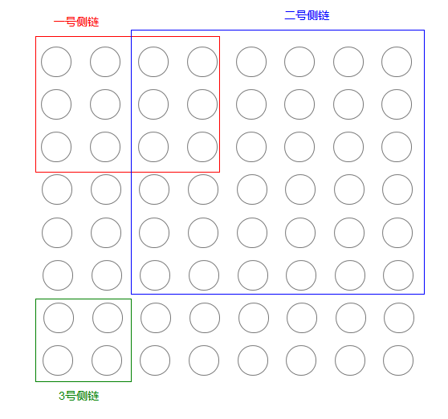
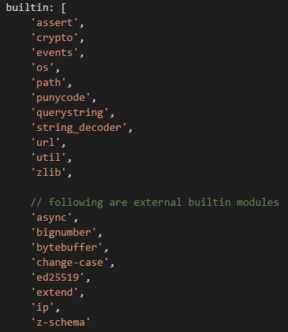
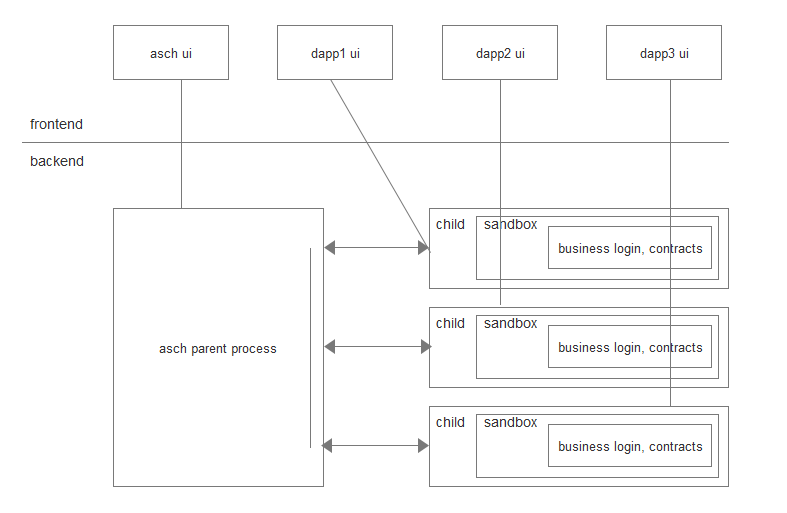

# Asch Dapp开发介绍

我们在白皮书里提到过，asch使用的是不同于以太坊和比特币的侧链架构，dapp是运行在侧链上的，每条侧链对应一个dapp。（Asch主链类比IOS生态系统，每个节点都是一部iphone，所有的dapp组成了appstore，每个节点可以自由选择安装哪些dapp）

## 侧链的独立性

侧链架构的好处是代码和数据独立，不增加主链的负担，避免数据过度膨胀，实际上是一种天然的分片机制。
侧链有独立的区块链（具有和一般区块链相同的特征属性），有独立的受托人或者说见证人，同时也有独立的节点网络，就是说一个侧链产生的区块只会在所有安装了该侧链的节点之间进行广播。

独立性既是优点，也是缺点。开发者完成了dapp的开发工作之后，还要考虑运维，也就是说要寻找足够的节点来运行它（Asch侧链默认用的DPOS共识算法，对运行节点的受托人会给予一定的token奖励，类比BTC的挖矿，所以找人去运行dapp是很容易的事情），否则难以维持足够的安全性。
从这一点来看，与以太坊相比，是缺陷，以太坊上一旦发布一个dapp，所有的节点都可以为它工作，并为它提供安全保障。

## 侧链的灵活性

但是侧链架构依然有存在的必要性，因为并非所有的应用都需要那么高的安全性。Asch给用户提供了一种可以选择的灵活性。
比方说，假设asch有1000个节点，那么其中有的dapp比较重要，需要500个节点来运行它，有的dapp不那么重要，可能只需要100个节点，这完全是由用户和开发者决定的。
在以太坊上，则只能选择一种，即全部节点都来运行它。据说以太坊也打算实现一种分片的机制，实际上这在asch系统中是一个早就解决了的问题。
另外，对于比较重要的、安全性要求较高的应用，我们依然可以选择在主链上开发（就是像以太坊那样dapp运行在所有的Asch主链的节点上），但是不可能对所有开发者开放这种权力，还是为了避免主链的膨胀和不可控(DAO事件)。

侧链的灵活性还表现在，所有的区块链参数是可以定制的，简单的比如区块间隔、区块奖励、交易费的去向等，高级用户还可以修改共识算法（默认是DPOS共识算法）。
不过最重要的还是业务逻辑，侧链上可以轻易的开发出与你的业务相关的交易类型或者智能合约。
这一点是与侧链的发明者blockstreams不同，blockstreams的侧链，只是一个不同的货币系统而已，开发新型交易和智能合约很不容易。

如下图所示
黑色的圆圈代表一个节点，64个节点组成了主链的网络。红色方框之内的是1号侧链，其侧链网络是由12个节点组成。蓝色方框之内的是2号侧链，其网络是由36个节点组成。



## 主链与侧链的互利关系

Asch的主链与侧链之间是互惠互利的关系，asch为侧链提供基础设施，比如数据库写入的api，网络通讯api，加密api等等，侧链则可以为asch主链补充更多的节点，以壮大整个系统。
侧链的开发者不需要提供所有的机器，可以利用已经存在主链节点，只需要节点主人安装该应用即可。
另外，主链的代币XAS可以转入侧链中，由于XAS可以在交易所交易，就相当于为侧链的资产提供了一种价值的媒介。
开发者在侧链发行一种资产后，可以直接与XAS兑换，不需要考虑交易平台的问题。

## 解决生产力问题

我们在[ASCH_DAPP_SDK](./asch_sdk_api.md)中为侧链提供了一套模板，或者说脚手架，也可以叫做开发框架，侧链的大部分底层功能都是写好的，dapp开发者只需要关心具体的业务逻辑，在这一点上，与以太坊的dapp开发难度相当。
Asch的侧链框架使用的语言是nodejs，我们内置了不少常用的库让开发者直接使用，当然开发者也可以自行安装所需要的，有一个庞大的javascript社区作为后盾。

下面是asch内置的模块



## 解决安全问题

这里的安全问题与上面提到的因为节点不足导致的问题不一样，这里说的安全问题是指侧链代码对安装者造成侵犯的问题。
我们希望每一个asch节点都能安装一个侧链，而且asch节点的主人无需信任侧链的开发者。这就需要提供一种安全防范的措施，比如，防止侧链代码肆意读取文件系统、进行网络操作。
在asch系统中，侧链代码会以子进程的方式启动，子进程首先加载一个使用沙箱机制隔离的javascript虚拟机，这个js虚拟机就是没有```require```以及任何多余模块的裸体虚拟机。
然后我们为这个虚拟机植入一个定制的```require```和一些常用且安全的模块, 最后再加载侧链的代码。
我们还通过进程间通讯的方式提供一系列的api。
这样，侧链的框架就拥有了足够多的api，同时侧链的安装者也没有任何风险。



## 实例教程

接下来我们会提供一个由浅入深的教程，帮助开发者快速入门。

- [Dapp开发教程一 Asch Dapp Hello World](./dapp_docs/1_hello.md)
  这个文档会教你如何创建并发布一个基础的侧链应用，并介绍侧链框架的源码结构
- [Dapp案例一 CCTime的后端源码](https://github.com/AschPlatform/cctime) 这是基于[ASCH_DAPP_SDK](./asch_sdk_api.md)开发的第一个Dapp，开发者可以当做示例代码阅读，[前端代码链接](https://github.com/AschPlatform/cctime-frontend)