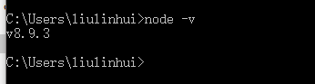
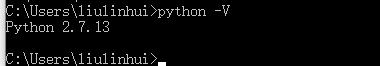
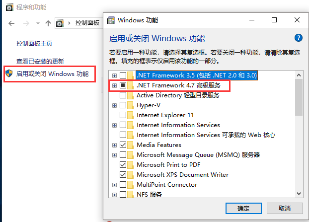
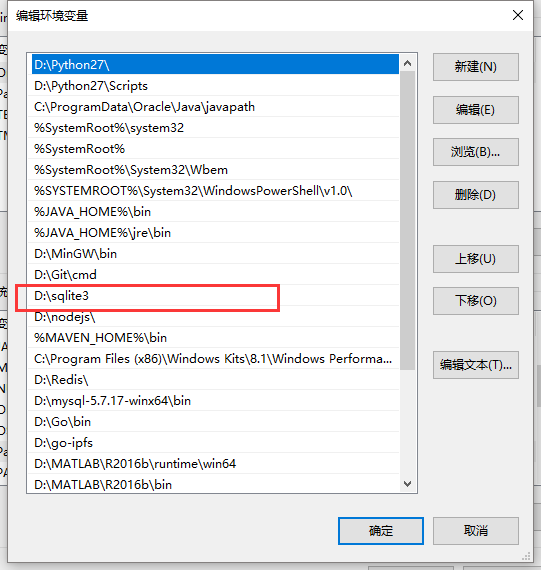
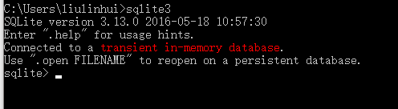
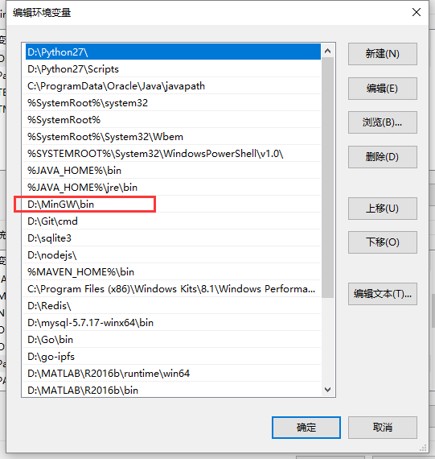
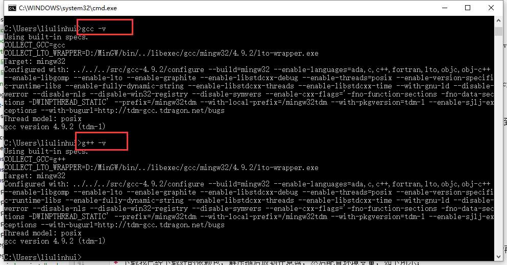
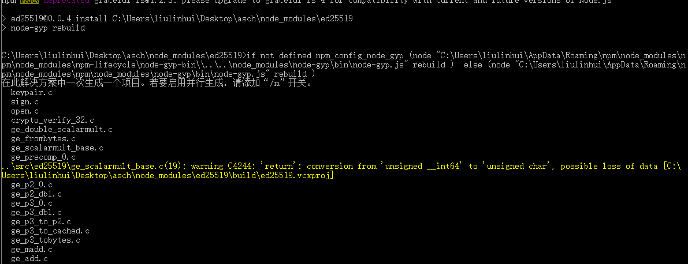
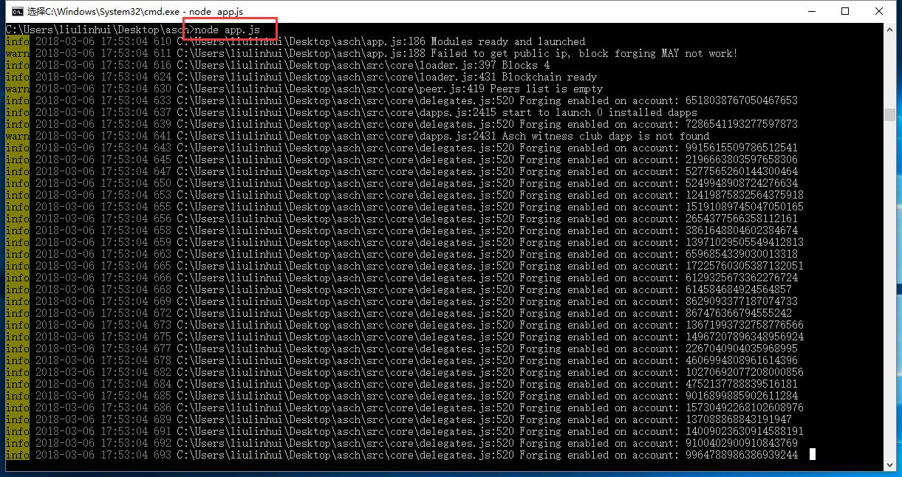

# Asch 本地开发环境搭建(Windows)

## 1 系统要求

- Windows操作系统(7/8/10)

## 2 安装nodejs
[安装nodejs](https://nodejs.org/en/download/) 配置环境变量，版本V6.3以上(以下的没有验证过),如下所示:



## 3 安装Python
[安装Python](https://www.python.org/downloads/release/python-2713/) 并配置环境变量，版本2.5到3.0之间（最好2.7，3.0以及以上版本不支持),如下所示:



## 4 安装.NET Framework 4.5.1
[下载](https://www.microsoft.com/en-us/download/details.aspx?id=42779) 并安装.NET Framework 4.5.1，如果系统已经安装了可以忽略此步骤(至少4.5版本)，win7系统可以直接打开控制**面板》程序》程序和功能** 查看
是否已经安装，win10系统默认已经安装好了,查看方式如下图所示:



## 5 安装 VC++ Build Tools Technical Preview
[下载](http://go.microsoft.com/fwlink/?LinkId=691126)并安装VC++ Build Tools Technical Preview，全部选择默认安装就行了，安装时间可能有点久(10分钟左右)

## 6 安装git
[下载](https://git-scm.com/)并安装git，应为asch使用gulp构建工具，其中包含一部分linux命令(如 cp、mv等)，所以后面执行命令的时候需要用到git bash

## 7 安装sqlite3
[下载](https://pan.baidu.com/s/1WvQYSCCr-n7N5HMCRGqwLA)已经打包好的sqlie3压缩文件，解压放到任意位置，然后添加环境变量，如下所示:



打开命令行验证如下:



## 8 安装gcc, g++
这里有如下两种方式：
* [下载mingw-get-setup](https://sourceforge.net/projects/mingw/files/Installer/)，然后再线安装所有依赖包，但是可能会比较慢
* 下载我已经下载好的依赖包，解压缩后放到任意盘，然后配置环境变量，如下所示：



安装完成后分别执行一下命令查看是否成功:
```
gcc -v
g++ -v
```

如下所示:



## 9 安装OpenSSL
[下载](http://slproweb.com/products/Win32OpenSSL.html)并安装OpenSSL，全部默认安装即可.

## 10 npm配置
首先执行以下命令配置淘宝镜像，这样使用npm下载的时候会更快一些
```
npm config set registry https://registry.npm.taobao.org

##验证
npm info npm
```

执行以下命令配置**msvs**
```
npm config set msvs_version 2015 --global
```

最后安装asch需要的一些依赖，执行以下命令:
```
npm i -g gulp
npm i -g bower
```

### 11 运行代码
> 运行前查看之前的 VC++ Build Tools Technical Preview 是否已经安装完成

注：运行代码之前需要说明一下，在asch3.0版本之前，用的椭圆曲线加密依赖为ed25519，而3.0以后使用的是sodium，
3.0之前的代码直接安装完依赖就可以运行，但是目前的3.0之后的源码需要改变几行代码，但是asch的所有功能都能正常运行，方便Windows用户本地开发调试使用。

修改以下两个文件的内容：
* src\utils\ed.js
* package.json

package.js:
```json
##原依赖
"sodium": "^2.0.3",

## 换成ed25519
"ed25519": "^0.0.4",
```

ed.js:
```
## 将文件所有内容换成一下代码
const ed = require('ed25519');
module.exports = {
    MakeKeypair: ed.MakeKeypair,

    Sign: ed.Sign,

    Verify: ed.Verify
};
```

修改完文件以后安装依赖：
```
npm install
```

因为Windows控制台本身的原因，安装过程中如果出现停顿可以按几下回车，如果出现以下步骤则说明前面一些安装成功了:



最后执行 **node app.js** 即可正常运行，如下图所示:



## 12 编译前端项目
前端项目具体编译打包操作可以参考 [前端项目的操作说明](../public/README.md)，不过这里需要注意一点，
所有的命令都要在 **git bash** 中进行，原因已经在之前安装git的时候说明了，依次执行以下命令即可：
```
cd public
npm install
gulp build-test
```

## 13 软件下载
考虑到部分软件可能因为网络原因无法下载，在这里提供一个所有依赖的软件 [下载地址](https://pan.baidu.com/s/1WLSH9M0Hwp16CPYOgZ_6GQ)


