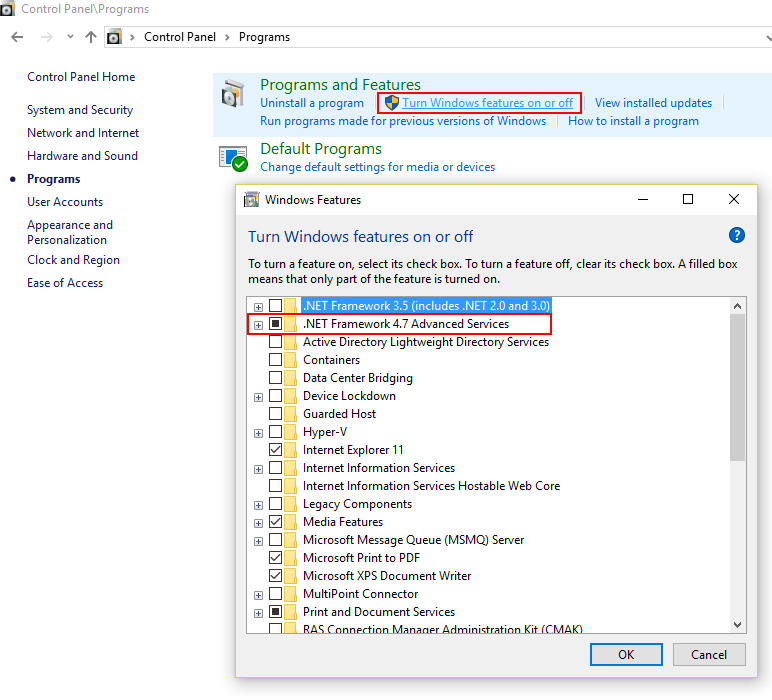
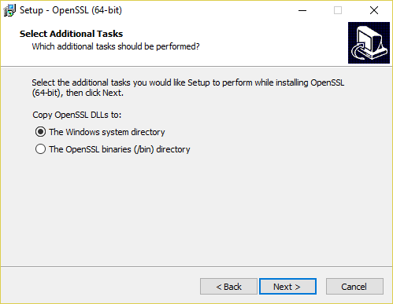

# Setup Local Asch Development Environment (Windows)

<!-- TOC -->

- [Setup Local Asch Development Environment (Windows)](#setup-local-asch-development-environment-windows)
  - [1 System Requirements](#1-system-requirements)
  - [2 Install node.js](#2-install-nodejs)
  - [3 Install Python](#3-install-python)
    - [Common Problem: Python can't be found](#common-problem-python-cant-be-found)
    - [Test Python Installation](#test-python-installation)
  - [4 Install .NET Framework 4.5.1](#4-install-net-framework-451)
  - [5 Install VC++ Build Tools Technical Preview](#5-install-vc-build-tools-technical-preview)
  - [6 Install git](#6-install-git)
  - [7 Install sqlite3](#7-install-sqlite3)
  - [8 Install MinGW (gcc, g++)](#8-install-mingw-gcc-g)
  - [10 Install OpenSSL](#10-install-openssl)
    - [Info](#info)
  - [11 Clone Asch Blockchain](#11-clone-asch-blockchain)
  - [12 Run the code](#12-run-the-code)
  - [13 Compile the front-end project](#13-compile-the-front-end-project)

<!-- /TOC -->


## 1 System Requirements

- Windows (7/8/10)

## 2 Install node.js
Install node.js version 6.3 or later.  
[Download node.js](https://nodejs.org/en/download/)


## 3 Install Python
Install version 2.5 up to 3.0. Python version v2.7 is preferred. Version v3.0 and above are not supported.  
[Download Python 2.7.13](https://www.python.org/downloads/release/python-2713/) 


### Common Problem: Python can't be found

Often can python not be found from the command line after the installation:  


Open the windows `Control Panel`  


Select `Environment Variables`:  


Edit `%PATH%`:  


Add new Environment Variable:  


Python is normally installed in `C:\Python27`.  


Add `C:\Python27\` to the Environment Variables:  


### Test Python Installation

Be sure to __restart__ your system before testing if it works.


## 4 Install .NET Framework 4.5.1

If the .NET Version 4.5 or higher is already installed ignore this step. On windows 10 .NET 4.5 is already installed.  
[Download .NET 4.5](https://www.microsoft.com/en-us/download/details.aspx?id=42779) 

Check if the `.NET 4.5`   is already installed:
* Open: Control Panel  
* Click: Programs  
* Click: Turn Windows features on or off  



## 5 Install VC++ Build Tools Technical Preview

Install the VC++ Build Tools Technical Preview. Choose the __custom__ installation.  
[Download](http://go.microsoft.com/fwlink/?LinkId=691126)  


Select:  
* __Windows 8.1 SDK__  
* __Windows 10 SDK__  


The installation can take up to 10 minutes.

Set in `npm` the Visual Studio Version to __2015__
```cmd
npm config set msvs_version 2015
```


[Reference](https://stackoverflow.com/questions/21069699/node-packages-not-building-on-windows-8-1-missing-microsoft-cpp-default-props)


## 6 Install git
 Download and install git. 
 You need to select `git bash console`.  
[Download git](https://git-scm.com/download/win)

Install Git Bash:  


Git use Windows Command Prompt:  


Select Git OpenSSL Version:  


Use Windows default console:  


## 7 Install sqlite3
[Download](https://sqlite.org/2018/sqlite-tools-win32-x86-3240000.zip)  

Unzip the zip archive  


Create new directory `C:\sqlite3`  


Edit `%PATH%`:  


Be sure to __restart__ your PC for the following command to work.  
Open the command line to verify the sqlite installation:


## 8 Install MinGW (gcc, g++)
Install MinGW from Sourceforge. The installation can take up to 10 minutes:  
* [download mingw-setup](https://sourceforge.net/projects/mingw/files/Installer/)

Download from Sourceforge:  


Setup:  


Apply Changes:  


Edit `%PATH%`:  


Àdd the environment variable `C:\MinGW\bin\`:  


Be sure to __restart__ your system in order for the following commands to work:  
```cmd
gcc -v
g++ -v
```

As follows:


## 10 Install OpenSSL

Install OpenSSL.  
[Download](http://slproweb.com/products/Win32OpenSSL.html)  

Select correct version:  


Choose Installation option:  


__Restart__ your PC in order for OpenSSL to work correctly.

### Info
Unfortunately due to a bug in in the npm package [ed25519](https://github.com/dazoe/ed25519) is it not possbile that we use the newest OpenSSL version (newest: `OpenSSL v1.1.0h`). Therefore we need to go with the older OpenSSL version `OpenSSL v1.0.2o`.

## 11 Clone Asch Blockchain

Clone the Asch Blockchain into an empty directory.
```cmd
git clone https://github.com/aschplatform/asch
```

## 12 Run the code
> Check whether the previous VC++ Build Tools Technical Preview has been installed before running

We need to change a few lines of code in order for the blockchain to work on windows.

* __Option 1__  
  Change the content of package.json
  package.json
  ```
  ## before
  "sodium": "^2.0.3"

  ## change sodium version to 2.0.1
  "sodium": "2.0.1"
  ```


* __Option 2__

  Modify the contents of the following two files:

  * src\utils\ed.js
  * package.json

  package.js:
  ```js
  ## originally relied on
  "sodium": "^2.0.3",

  ## Change to ed25519
  "ed25519": "^0.0.4",
  ```

  ed.js:
  ```js
  ## Replace all the contents of the file with the following code
  const ed = require('ed25519');
  module.exports = {
      MakeKeypair: ed.MakeKeypair,

      Sign: ed.Sign,

      Verify: ed.Verify
  };
  ```

After __Option1__ or __Option2__ install the dependencies:
```cmd
npm install
```


Because of the Windows console, there could be a pause during installation. Maybe you have to press Enter several times. If the following steps appear, it means that the previous installation steps were successful:


Finally, execute **node app.js** to start the blockchain, as shown in the following figure:


[Reference node-gyp problem](https://github.com/nodejs/node-gyp/issues/629#issuecomment-153196245)


## 13 Compile the front-end project
The following commands need to be executed in **git bash** in a __new__ console. The first console is already busy with running the blockchain.  
Execute the following commands in order:

```bash
# change directory
cd pubilc
```

Install the dependencies for the frontend application
```bash
npm install yarn --global
npm install browserify --global
npm install gulp --globalg

yarn install
```

Build the frontend application for the localnet.
```bash
gulp build-local
```
