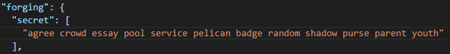

# Asch Knoten Installation Anleitung

## 1. System Anforderung
- Linux-System erforderlich
- Öffentliche IP-Adresse erforderlich
- Ubuntu 16.04 64bit OS empfohlen
- Mehr als 2Gb RAM wird empfohlen
- Mehr als 2Mb Bandbreite wird empfohlen
- Mehr als 10GB Festplattespeicher wird empfohlen

## 2. Installation

Es gibt zwei unterschiedliche Systeme: Das Testsystem (testnet) und Hauptsystem (mainnet). Beide existieren nebeneinander, können aber nicht miteinander kommunizieren.

Die Schritte zur Installation sind für diese beiden System die Gleichen. Bis auf das Installationspaket und die Datei-Konfiguration (inklusive der Port Einstellungen).

So lange es keinen Konflikt mit den Ports gibt, ist es möglich die beiden Versionen nebeneinander auf dem Computer zu installieren. Dies ist jedoch nicht empfohlen, da alle Ressourcen benötigt werden. Am besten eignet sich ein Server mit einer 4 Kerne CPU, 4GB RAM und mindestens 4MB Netzwerkanbindung.


### 2.1 Downloaden und Entpacken

test version (testnet)  

```
wget https://www.asch.so/downloads/asch-linux-latest-testnet.tar.gz
tar zxvf asch-linux-latest-testnet.tar.gz
```

official version (mainnet)
```
wget https://www.asch.so/downloads/asch-linux-latest-mainnet.tar.gz
tar zxvf asch-linux-latest-mainnet.tar.gz
```

Üblicherweise ist die Versionsnumber der Testchain höher als die der Mainchain.

### 2.2 Initialisierung
In diesem Schritt werden folgenden Dinge automatisch installiert:
- Installtion von Module wie **sqlite3**
- Installation und Konfiguration des NTP-Service, welcher die Systemzeit mit der der anderen Knoten synchronisiert

Dieser Schritt muss nicht ausgeführt werden, es passiert aber nichts Schlimmes, wenn er öfters ausgeführt wird.

	# dies soll im Installations-Verzeichnis ausgeführt werden
	./aschd configure
	...

## 3. Starten
```
# Folgende Kommandos werden im Installations-Verzeichnis ausgeführt

# das Service starten
./aschd start

# das Service stoppen
./aschd stop

# zeige den aktuellen Status
./aschd status

# das Service neustarten
./aschd restart

# ein Asch-Upgrade durchführen
./aschd upgrade

# die blockchain resynchronisieren
./aschd rebuild

# die Asch-Version anzeigen lassen
./aschd version

# mit der Blöcke-Produzieren starten
./aschd enable "your sercret"

# die Logs anzeigen
tail -f logs/debug.log
```

## 4. Delegat Konfiguration
### 4.1 Delegat Passwort

Öffne mit deinem Lieblingseditor folgende Datei `config.json` und navigiere zum `[secret]` Feld. Fülle dieses Feld mit dem Passwort des Delegats. Dieses Feld ist eine JSON-String-Array welches verwendet werden kann um mehrere Passwörter zu setzen. Sei vorsichtig kein Passwort zu wiederholen.



**HINWEIS:** Konfiguriere NIEMALS das selbe Passwort. Egal ob auf einem Rechner oder auf unterschiedlichen. 


### 4.2 Öffentliche IP-Adresse
Von Haus aus erkennt das System automatisch die zugewiesene öffentliche IP-Adresse. Aber auf manchen Knoten in der Cloud kann die öffentliche IP-Adresse nicht identifiziert werden. Unter diesen Umständen muss folgendes Feld an die Datei `config.json` angehängt werden.


```
"publicIp": "Hier steht die öffentliche IP-Adresse",
```
Vergiss nicht das System nach der Konfiguration mit folgendem Befehl neu zu starten.
```
./aschd restart
```

## 5. System Upgrade
```
./aschd upgrade
./aschd start
```
## 6. Fehlerbehebung
### 6.1 Ich kann nicht auf meine Online-Wallet zugreifen
#### Lösung 1
Überprüfe das `[port]` Feld in der `config.json` Datei. Die default Portnummer für das **testnet** ist `4096` und für das **mainnet** `8192`.
Die offiziellen Seed-Nodes haben die Portnummer auf 80 geändert.
Überprüfe die Firewall-Einstellungen und öffne den Asch-Port für eingehenden und ausgehenden Verkehr.

#### Lösung 2
Überprüfe ob mit folgendem Kommando ob der Service gestartet ist:
```
./aschd status

# falls der Service nicht läuft kommt folgende Meldung:
Asch server is not running

# danach starte das Service neu
./aschd restart
```

### 6.2 Es werden keine Blöcke produziert
#### Lösung 1
Stelle sicher, dass dein Delegat-Rank unter den TOP 101 ist

#### Lösung 2
Überprüfe den Fehler-Log mit folgendem Kommando:
```
grep Failed logs/debug.log
```
Falls es eine ähnliche Fehlernachricht gibt wie:
```
Failed to get public ip, block forging MAY not work!
```
bedeutet dies, dass das system nicht die öffentliche IP-Adresse hat. Dies muss manuell konfiguriert werden. Siehe **[4.2 Public IP]**

#### Lösung 3
Überprüfe den Fehler-Log mit folgendem Kommando:
```
grep error logs/debug.log
```
Falls es eine ähnliche Fehlernachricht gibt wie:
```
Failed to load delegates: Account xxxxxxxxx not found
```
bedeutet dies, dass die Passphrase für dein Konto noch nicht als Delegat registriert wurde. Es kann auch sein, dass der Service gestartet wurde bevor er als Delegat registriert wurde. In diesem Fall hilft ein einfaches neustarten des Services.

**HINWEIS:** Falls dein Knoten gerade die Blöcke synchronisiert ist es zu empfehlen das System erst nach der abgeschlossenen Sychronisation zu starten.
```
./aschd restart
```
Wenn das System erfolgreich neugestartet wurde, ist folgendes im Log zu lesen:
```
grep Forging logs/debug.log

Forging enabled on account: xxxxxxxxxxxxxx
```
### 6.3 Meine Blöcke werden nicht sychronisiert (Blockhöhe wächst nicht)
*Dieses Problem kann verifiziert werden in dem man seine Blockhöhe mit der des offiziellen Knotens vergleicht

Als allererstes, versuche das System neu zu starten
```
./aschd restart
```
Falls das Problem noch immer auftritt, versuche folgendes:`
```
./aschd rebuild
```
