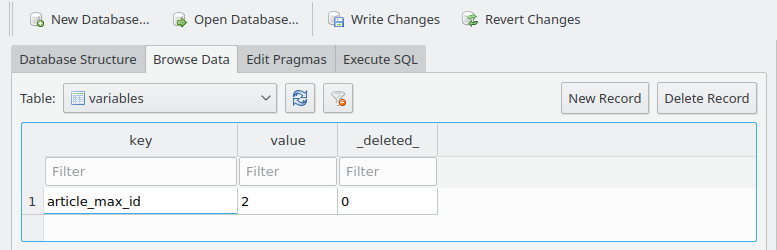
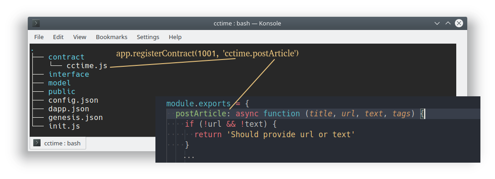

# Table of Contents

<!-- TOC -->

- [Table of Contents](#table-of-contents)
- [Asch SDK API](#asch-sdk-api)
  - [**1. Database**](#1-database)
    - [1.1 `aync` app.sdb.load(model, fields, indices)](#11-aync-appsdbloadmodel-fields-indices)
    - [1.2 app.sdb.get(model, cond)](#12-appsdbgetmodel-cond)
    - [1.3 app.sdb.keys(model)](#13-appsdbkeysmodel)
    - [1.4 app.sdb.entries(model)](#14-appsdbentriesmodel)
    - [1.5 ap.sdb.lock(key)](#15-apsdblockkey)
    - [1.6 app.sdb.create(model, values)](#16-appsdbcreatemodel-values)
    - [1.7 app.sdb.replace(model, values)](#17-appsdbreplacemodel-values)
    - [1.8 app.sdb.update(model, modifier, cond)](#18-appsdbupdatemodel-modifier-cond)
    - [1.9 app.sdb.increment(model, modifier, cond)](#19-appsdbincrementmodel-modifier-cond)
    - [1.10 app.sdb.del(model, cond)](#110-appsdbdelmodel-cond)
  - [2. Balance](#2-balance)
    - [2.1 app.balances.get(address, currency)](#21-appbalancesgetaddress-currency)
    - [2.2 app.balances.increase(address, currency, amount)](#22-appbalancesincreaseaddress-currency-amount)
    - [2.3 app.balances.decrease(address, currency, amount)](#23-appbalancesdecreaseaddress-currency-amount)
    - [2.4 app.balances.transfer(currency, amount, from, to)](#24-appbalancestransfercurrency-amount-from-to)
  - [3 Data model](#3-data-model)
    - [3.1 app.model[name]](#31-appmodelname)
    - [3.2 fields()](#32-fields)
    - [3.3 count(cond)](#33-countcond)
    - [3.4 exists(cond)](#34-existscond)
    - [3.5 findOne(options)](#35-findoneoptions)
    - [3.6 findAll(options)](#36-findalloptions)
  - [4. Routing](#4-routing)
    - [4.1 app.route.get(path, handler)](#41-approutegetpath-handler)
    - [4.2 app.route.post(path, handler)](#42-approutepostpath-handler)
    - [4.3 app.route.put(path, handler)](#43-approuteputpath-handler)
  - [5. Cost pool](#5-cost-pool)
    - [5.1 app.feePool.add(currency, amount)](#51-appfeepooladdcurrency-amount)
  - [6. Increment ID](#6-increment-id)
    - [6.1 app.autoID.get(name)](#61-appautoidgetname)
    - [6.2 app.autoID.increment(name)](#62-appautoidincrementname)
  - [7. Logging](#7-logging)
    - [7.1 app.logger.setLevel(level)](#71-apploggersetlevellevel)
    - [7.2 app.logger.log()](#72-apploggerlog)
    - [7.3 app.logger.trace()](#73-apploggertrace)
    - [7.4 app.logger.debug()](#74-apploggerdebug)
    - [7.5 app.logger.info()](#75-apploggerinfo)
    - [7.6 app.logger.warn()](#76-apploggerwarn)
    - [7.7 app.logger.error()](#77-apploggererror)
  - [8. Tools](#8-tools)
    - [8.1 app.validate(type, value)](#81-appvalidatetype-value)
    - [8.2 app.registerContract(type, name)](#82-appregistercontracttype-name)
    - [8.3 app.getContractName(type)](#83-appgetcontractnametype)
    - [8.4 app.registerFee(type, min, currency)](#84-appregisterfeetype-min-currency)
    - [8.5 app.getFee(type)](#85-appgetfeetype)
    - [8.6 app.setDefaultFee(min, currency)](#86-appsetdefaultfeemin-currency)
    - [8.7 app.getRealTime(epochTime)](#87-appgetrealtimeepochtime)
    - [8.8 app.registerHook](#88-appregisterhook)
        - [8.8.1 beforeCreateBlock](#881-beforecreateblock)
    - [8.9 app.custom[]](#89-appcustom)
    - [8.10 app.meta](#810-appmeta)

<!-- /TOC -->

# Asch SDK API


## **1. Database**

### 1.1 `aync` app.sdb.load(model, fields, indices)

- `model` Datamodel
- `fields` Fields of the data model
- `indices` Array of indexes, it can be a single field index or a multi field index (provide an string array)

> The operation has no return value, it throws an Exception when an error occurs  
> Load the data for the specified model into memory and index the table which can further improve the efficiency of the query
> When a data model needs frequent updates and inquiries, it is recommended to use this interface, such as the system's built-in account balance, the increment ID uses this operation 

Example:

```js
await app.sdb.load('Balance', app.model.Balance.fields(), [['address', 'currency']])
await app.sdb.load('Variable', ['key', 'value'], ['key'])
```

### 1.2 app.sdb.get(model, cond)

- `model` Datamodel
- `cond` Query conditions

> Returns the model that matched the query conditions  
> Query the data according to the specified query condition. When the model can't be loaded an exception will be thrown. Query conditions will also throw an error if the key value is not indexed

Example:

```js
app.sdb.get('Variable', { key: 'foo' })
/* output:
{
  key: 'foo',
  value: 'bar'
}
*/

let balance = app.sdb.get('Balance', { address: 'foo', currency: 'XAS' })
/* output:
{
  address: 'foo',
  currency: 'XAS',
  balance: '1000000'
}
*/
```

### 1.3 app.sdb.keys(model)

- `model` Model

> This operation returns all indexed fields for a model

Example:

```js
let keys = app.sdb.keys('Variable')
for (let i of keys) {
  console.log(i)
}
/* output:
foo
foo1
foo2
*/
```


### 1.4 app.sdb.entries(model)

- `model` Model name

> Returns all cached fields for a data model

Example:

```js
let entries = app.sdb.entries('Variable')
for (let [key, value] of entries) {
  console.log(key, value)
}
/* output:
foo bar
foo1 bar1
foo2 bar2
*/
```

### 1.5 ap.sdb.lock(key)

- `key` 

> No return value  
> Lock a key. This lock is valid for the timespan of a block interval. A block life cycle does not allow a second lock or an exception will be thrown.  
> This features is to prevent a duplicate call in a block life cycle. For example: A contract needs to set a nickname for an account. Before the contract call is confirmed, we need to prevent that the nickname is set again. Therefore we can use the lock function.

Example:

```js
let senderId = 'AHMCKebuL2nRYDgszf9J2KjVZzAw95WUyB'
app.sdb.lock(`cctime.postArticle@${senderId}`)
```

### 1.6 app.sdb.create(model, values)

- `model` Model
- `values` Data items that will be created

> No return value  
> This operation creates a data item that updates the cache in real time if the model is cached. After the block is confirmed, the data will be persisted in the database.

Example:

```js
app.sdb.create('Article', {
  title: 'This is an article title',
  content: 'article contents',
  author: 'qingfeng',
  tag: 'Science'
})
```

### 1.7 app.sdb.replace(model, values)

- `model` model
- `values` data item that will be created or updated

> No return value  
> Create or update the data model. If the data model already exists, update it. The parameter `values` must must contain the primary key.

Example:

```js
app.sdb.replace('Account', {
  address: 'AC3pinmvz9qX9cj6c7VrGigq7bpPxVJq85',
  nickname: 'Nakamoto'
})
```

### 1.8 app.sdb.update(model, modifier, cond)

- `model` Model
- `modifier` Data item that should be updated
- `cond` Update condition

> No return value  
> One or many data items of a model are updated according to the update condition.

Example:

```js
app.sdb.update('Account', { nickname: 'Nakamoto' }, { nickname: 'Satoshi' })
```

### 1.9 app.sdb.increment(model, modifier, cond)

- `model` Model
- `modifier` Data item that should be updated
- `cond` Update condition

> Incremental update of a model by specified number. This can only be used to update integer types.

Example:

```js
app.sdb.increment('Article', { votes: -10 }, { id: '10000' })
app.sdb.increment('Article', { comments: 1 }, { id: '10000' })
```

### 1.10 app.sdb.del(model, cond)

- `model` Model name
- `cond` Delete condition

> No return value  
> Delete data items in a model according to a query condition  
> The implementation of the delete operation is currently marked as obsolete. This query interface will not delete model data. However, a custom implementation can still delete data.

Example:

```js
app.sdb.del('Article', { id: '100001' })
```

## 2. Balance

### 2.1 app.balances.get(address, currency)

- `address` Account address
- `currency` Currency

> Returns the balance of the specified account

Example:

```js
app.balances.get('AC3pinmvz9qX9cj6c7VrGigq7bpPxVJq85', 'XAS')
/* output:
{
  address: 'AC3pinmvz9qX9cj6c7VrGigq7bpPxVJq85',
  currency: 'XAS',
  balance: '10000000'
}
*/
```

### 2.2 app.balances.increase(address, currency, amount)

- `address` Account address
- `currency` Currency
- `amount` Amount to increase

> No return value  
> This operation raises the balance of the address by `amount` (amount to increase).

Example:

```js
app.balances.increase('AC3pinmvz9qX9cj6c7VrGigq7bpPxVJq85', 'XAS', '100000')
```

### 2.3 app.balances.decrease(address, currency, amount)

- `address` Account address
- `currency` Currency
- `amount` Amount to subtract

> No return value  
> This operation subtracts the `amount` of the balance.

Example:

```js
app.balances.decrease('AC3pinmvz9qX9cj6c7VrGigq7bpPxVJq85', 'XAS', '100000')
```

### 2.4 app.balances.transfer(currency, amount, from, to)

- `currency` Currency
- `amount` Amount to transfer
- `from` Sender
- `to` Recipient

> No return value  
> Transfers assets between two accounts

Example:

```js
app.balances.transfer('XAS', '100000', 'AC3pinmvz9qX9cj6c7VrGigq7bpPxVJq85', 'A4MFPoF3c9vCzZ3GGf9sNQ3rDy2q8aXuVF')
```

## 3 Data model

### 3.1 app.model[name]

- `name` Model name

> Returns an instance of the model

### 3.2 fields()

> Returns all fields of the model

```js
app.model.Article.fields()
/* output:
[
  'id',
  'tid',
  'authorId',
  'timestamp',
  'title',
  'url',
  'text',
  'tags',
  'votes',
  'comments',
  'reports'
]
*/
```

### 3.3 count(cond)

- `cond` Query condition

> Returns a `Number`  
> The total number of data items that match the specified condition.

Example:

```js
app.model.Block.count({ height: { $lt: 100 } })
/* output:
99
/*
```

### 3.4 exists(cond)

- `cond` Query condition

> Returns a `Boolean`  
> Indicates whether the data item for the specified condition exists.

Example:

```js
app.model.Transaction.exists({ id: '9a5ec0669c79b9f5a1d5a4dbb2c200bc28c9ea829dbff71f41cbb2ad5a7d9b01' })
/* output:
false
/*

app.model.Account.exists({ nickname: 'Nakamoto' })
/* output:
true
*/
```

### 3.5 findOne(options)

`options` Is an object that has the following properties:

- `condition` Query conditions
- `fields` The field that should be returned

> Query data items for a specified condition.

Example:

```js
app.model.Account.findOne({ nickname: 'Nakamoto' })
/* output:
{
  address: 'AC3pinmvz9qX9cj6c7VrGigq7bpPxVJq85',
  nickname: 'Nakamoto',
  ...other values
}
*/
```

### 3.6 findAll(options)

`options` Is an object that has the following properties:

- `condition` Query condition
- `fields` Fields to return
- `sort` Fields to sort after
- `limit` The maximum number to return
- `offset` Offset

> Query all data items for the specified condition

Example:

```js
app.model.Transfer.findAll({ senderId: 'AC3pinmvz9qX9cj6c7VrGigq7bpPxVJq85'})
/* output:
[
  {
    tid: "50e062f25946d220b924cb5ec6e52e260e44c9417d9f3c8ea041b704e06895f7",
    senderId: "AFnwUuET2XddPtqpFb2ns78CQEqc7KZ6vD",
    recipientId: "asdasdasd",
    currency: "CCTime.XCT",
    amount: "100000000",
    t_timestamp: 38660145,
    t_type: 3,
    t_height: 93953
  },
  {
    tid: "f15ce92add809b4a132936d514dce7fa7bdc15e850e7c026a001625b48595af3",
    senderId: "AFnwUuET2XddPtqpFb2ns78CQEqc7KZ6vD",
    recipientId: "asdasd",
    currency: "CCTime.XCT",
    amount: "100000000",
    t_timestamp: 38660096,
    t_type: 3,
    t_height: 93948
  }
]
*/
```

## 4. Routing

- `path` Path
- `handler` Http Request Handler (async)

### 4.1 app.route.get(path, handler)

> Register a `get` type `http` request handler


Example:  
```js
// file-name: interface/index.js
// Access this API endpoint with a GET call to `http://localhost:4096/api/dapps/<dappId>/articles`

app.route.get('/articles', async (req) => {

  let articles = await app.model.Article.findAll({
    limit: 50,
    offset: 0,
    sort: { timestamp: -1 }
  })

  return articles
})

```

### 4.2 app.route.post(path, handler)

> Register a `post` type  `http` request handler

### 4.3 app.route.put(path, handler)

> Register a `put` type `http` request handler

## 5. Cost pool

### 5.1 app.feePool.add(currency, amount)

- `currency` Currency
- `amount` Amount

> No return value  
> The specified asset (currency) is added to the fee pool (the amount is evenly distributed to all accountants at the end of each round).

Example:

```js
app.feelPool.add('XAS', '10000000')
```

## 6. Increment ID

The creation of a table `articles` (with primary key id) results into the creation of a variable `article_max_id`. This new variable can be incremented.

Example:  
```js
// file-name: model/article.js
module.exports = {
  name: 'articles',
  fields: [
    {
      name: 'id',
      type: 'Number',
      not_null: true,
      primary_key: true
    }
  ]
}
```



### 6.1 app.autoID.get(name)

- `name` Id Type

> Returns a `String`  
> Get the highest Id of a type

Example:  
```js
const aid = 'article_max_id'
app.autoID.get(aid) === '0' // true
```

### 6.2 app.autoID.increment(name)

- `name` Id Type

> Returns a `String`  
> Increment the Id of the specified type by 1 and return the updated value as a string. This is equivalent to the `++i` operation in javascript.

Example:

```js
const aid = 'article_max_id'
app.autoID.get(aid) === '0'
app.autoID.increment(aid) === '1'
app.autoID.get(aid) === '1'
```

## 7. Logging

### 7.1 app.logger.setLevel(level)

Example:  
```js
app.logger.setLevel('debug')
app.logger.setLevel('info')
```

### 7.2 app.logger.log()

Example:  
```js
app.logger.log('hello')
```

### 7.3 app.logger.trace()

Example:  
```js
app.logger.trace('hello', 'world');
```

### 7.4 app.logger.debug()

Example:  
```js
app.logger.debug('hello %s',  'world', 123)
```

### 7.5 app.logger.info()

Example:  
```js
app.logger.info('hello %s %d',  'world', 123, {foo:'bar'})
```

### 7.6 app.logger.warn()

Example:  
```js
app.logger.warn('hello %s %d %j', 'world', 123, {foo:'bar'})
```

### 7.7 app.logger.error()

Example:  
```js
app.logger.error('hello %s %d %j', 'world', 123, {foo:'bar'}, [1, 2, 3, 4], Object)
```

## 8. Tools

### 8.1 app.validate(type, value)

- `type` The datatype that should be verified
- `value` Data value which will be verified

> Verify that a data is matches the specification. If not, throw an exception.

Example:

```js
app.validate('amount', '10000') // pase
app.validate('amount', 10000) // throws
app.validate('amount', 'abc') // throws
app.validate('amount', '1e10') // throws

app.validate('string', title, { length: { minimum: 5, maximum: 256 }})
app.validate('string', image, { length: { minimum: 15, maximum: 256 }})
app.validate('string', image, { url: { schemes: ["http", "https"] }})
app.validate('string', desc, { length: { minimum: 1000, maximum: 4096 }})
```

### 8.2 app.registerContract(type, name)

- `type` Contract Type
- `name` The name of contract

> No return value  
> To register a number type for a contract, an unregistered contract can not be called externally


Example:

```js
app.registerContract(1001, 'cctime.postArticle')
```


The string `'cctime.postArticle'` means, that they must be a `cctime` file in the `contract` directory and in the `cctime` file a function named `postArticle`.




### 8.3 app.getContractName(type)

- `type` The type or the number of the contract

> Get the contract name for a specified type 

Example:

```js
app.getContractName(1001) === 'cctime.postArticle'
```

### 8.4 app.registerFee(type, min, currency)

- `type` The type or the the number of the contract
- `min` Minimum cost
- `currency` Currency

> The minimum fee for a contract registration  
> `Min` stands for the minimum cost. The fee to call the contract. The fee can not be less then `min`. The fee can be greater. The execess part will be send to the fee pool.

Example:

```js
app.registerFee(1001, '100000', 'XAS')
```
### 8.5 app.getFee(type)

- `type` The type or number of the contract

> Get the specified fee for a contract

Example:

```js
app.getFee(1001)
/* output: */
{
  min: '100000',
  currency: 'XAS'
}
```

### 8.6 app.setDefaultFee(min, currency)

- `min` Minimum cost
- `currency` Currency

> Set default fee for all contracts in the system.

Example:

```js
app.setDefaultFee('10000', 'XAS')
```

### 8.7 app.getRealTime(epochTime)

- `epochTime` The number of seconds since the creation of the block. 

> Returns a timestamp which is the time of the block creation plus the offset in milliseconds  
> Asch systems timestamp is not a real timestamp. It is timespan. You can call this function to get a real timestamp

Example:

```js
app.getRealTime(4353634)
```

### 8.8 app.registerHook

##### 8.8.1 beforeCreateBlock

> The callback `beforeCreateBlock` can be used to execute code before a new block gets created. This callback is executed before each block.


Params Properties:  

|Name |Type | Description |  
|------ |-----  |----   |
|height|number | Get the upcoming block height.<br /> code: `modules.blockchain.blocks.getLastBlock().height + 1` |  
|pointId|string |block-id of the corresponding block in the mainchain <br /> e.g. `802231c4798740e12bf702bd88fbb41b5b93c709e75abedc585b7813f11c76ce` |  
|pointHeight |number |block-height of the corresponding block in the mainchain<br /> e.g.`2847` |  
|slotTime |timestamp |time in which the sidechain-block and the mainchain-block was created. The timestamp is in epoch-time e.g. `62551620`<br />See [8.7 app.getRealTime(epochTime)](#87-appgetrealtimeepochtime) for details |  
|signTransaction |method |Parameters: object with the following properties <br />__type:__ Smart contract Number e.g. 1000 <br />__fee:__ The fee of the smart contract <br />__args:__ a JSON stringified array with parameters for the smart contract |  
|addTransactions |method |Parameters: array of signed transactions<br />Usually the result from multiple calls to `params.signTransaction` |  


Simple Example:  
```js
// file-name. init.js

module.exports = async function () {
  app.logger.info('enter dapp init')

  app.registerHook('beforeCreateBlock', async (params) => {
    // action
  })
}
```


Advanced Example: Delete tweet-like message after certain block height
```js
// file-name: model/tweet.js
module.exports = {
  name: 'tweets',
  fields: [
    {
      name: 'id',
      type: 'Number',
      not_null: true,
      primary_key: true
    },
    {
      name: 'tid',
      type: 'String',
      length: 64,
      not_null: true,
      unique: true,
      index: true
    },
    {
      name: 'creator',
      type: 'String',
      length: 50,
      not_null: true,
      index: true
    },
    {
      name: 'timestamp',
      type: 'Number',
      not_null: true,
      index: true
    },
    {
      name: 'title',
      type: 'String',
      length: 128,
      not_null: true
    },
    {
      name: 'message',
      type: 'String',
      length: 256,
      not_null: true
    },
    {
      name: 'endingBlockHeight',
      type: 'BigInt',
      not_null: true
    }
  ]
}
```

```js
// file-name contract/tweet.js
module.exports = {
  tweet: async function (title, message, endingBlockHeight) {
    app.validate('string', title, { length: { minimum: 5, maximum: 128 }})
    app.validate('string', message, { length: { minimum: 20, maximum: 256 }})
    app.validate('amount', endingBlockHeight)

    let tweetId = app.autoID.increment('tweet_max_id')
    app.sdb.create('Tweet', {
      id: tweetId,
      tid: this.trs.id,
      creator: this.trs.senderId,
      timestamp: this.trs.timestamp,
      title: title,
      message: message,
      endingBlockHeight: endingBlockHeight
    })
  },
  deleteTweet: async function (tweetId) {
    // only delegates can delete tweets
    if (app.meta.delegates.indexOf(this.trs.senderPublicKey) === -1) {
      return 'Permission denied'
    }
    await app.sdb.del('Tweet', { id: tweetId })
  }
}
```

```js
// file: interface/tweet.js
app.route.get('/tweets', async (req) => {

  let tweets = await app.model.Tweet.findAll({})

  return tweets
})
```

```js
// file-name init.js

async function deleteTweets (params) {
  app.logger.info(`current sidechain block height: ${params.height}`)

  // load all tweets that should be closed
  let tweetsToClose = await app.model.Tweet.findAll({
    condition: {
      endingBlockHeight: {
        $lt: params.height - 1
      }
    }
  })

  if (!tweetsToClose.length) {
    return
  }
  app.logger.info(`closing ${tweetsToClose.length} tweets`)
  
  let transactions = tweetsToClose.map((tw) => {
    return params.signTransaction({
      type: 1001,
      fee: '0',
      args: JSON.stringify([tw.id])
    })
  })

  await params.addTransactions(transactions)
}


module.exports = async function () {
  app.logger.info('enter dapp init')

  // register contract: 'fileName.functionName'
  app.registerContract(1000, 'tweet.tweet')
  app.registerContract(1001, 'tweet.deleteTweet')

  app.setDefaultFee('0', 'XAS')

  app.registerHook('beforeCreateBlock', deleteTweets)
}
```


### 8.9 app.custom[]

> The application's namespace can be used to save some of the application's own custom global variables, mainly to isolate system-wide global variables

This namespace can be used for example for a custom cache implementation

Example: Create custom cache implementation  
  
```js
// file-name: lib/interval-cache.js
class IntervalCache {
  constructor(interval) {
    if (!Number.isInteger(interval)) throw new Error('Invalid interval')
    this.interval = interval
    this.container = new Map
    setInterval(() => {
      this.container.clear()
    }, interval)
  }
  has(key) {
    return this.container.has(key)
  }
  set(key, value) {
    this.container.set(key, value)
  }
  get(key) {
    return this.container.get(key)
  }
}

module.exports = IntervalCache
```

Register own custom cache implementation:
```js
// file-name: init.js
const IntervalCache = require('./lib/interval-cache')

module.exports = async function () {
  app.logger.info('enter dapp init')

  app.registerContract(1000, 'cctime.postArticle')
  app.registerContract(1001, 'cctime.postComment')
  app.registerContract(1002, 'cctime.voteArticle')
  app.registerContract(1003, 'cctime.likeComment')
  app.registerContract(1004, 'cctime.report')

  app.setDefaultFee('10000000', 'CCTime.XCT')

  // set cache
  app.custom.cache = new IntervalCache(10 * 1000)
}
```

Use cache:
```js
// file-name: interface/index.js

app.route.get('/articles/:id', async (req) => {
  let id = req.params.id
  let key = 'article_' + id

  // check cache
  if (app.custom.cache.has(key)) {
    return app.custom.cache.get(key)
  }
  let article = await app.model.Article.findOne({
    condition: { id: id }
  })
  if (!article) throw new Error('Article not found')
  if (article.reports >= 3) throw new Error('Article not allowed')
  let account = await app.model.Account.findOne({
    condition: { address: article.authorId }
  })
  if (account) {
    article.nickname = account.str1
  }
  let result = { article: article }

  // set cache
  app.custom.cache.set(key, result)
  return result
})

// ommitted further api endpoints...
```

### 8.10 app.meta

> Returns object  
> With `app.meta` you can access meta-information about your dapp, like name, which delegates are responsible etc...

Warning:  
This information is not available in `init.js`, because it is not loaded yet.

`app.meta` has following properties:

|Name |Type | Description |  
|------ |-----  |----   |
|name    |string   |The name of the dapp.<br />e.g. asch-dapp-cctime|
|description |string |The description of the dapp.<br />e.g. Decentralized news channel |
|tags |string|A comma seperated list of tags that categorize this Dapp<br />e.g. asch,dapp,demo,cctime |
|link |url|The link to the .zip archive of the source code.<br />e.g. https://github.com/AschPlatform/asch-dapp-cctime/archive/master.zip |
|type | | |
|category |number  |Identifies an dapp category<br />e.g. 1 |
|icon |url|An URL to the dapp icon<br />e.g.http://o7dyh3w0x.bkt.clouddn.com/hello.png|
|delegates |array |An array of the public keys of the delegates |
|unlockDelegates |number | |
|transactionId |string |The mainchain-transaction in which this dapp was registered<br />e.g. f30b85cff0d57d949ee84950bf59dbfbeebc369c0287cd6ea3f3d7501994a42a |

Example: Use `app.meta` to allow access to a smart contract only to the dapp delegates

```js
// file-name: contract/tweet.js

module.exports = {
  deleteTweet: async function (tweetId) {
    // only delegates can delete tweets
    if (app.meta.delegates.indexOf(this.trs.senderPublicKey) === -1) {
      return 'Permission denied'
    }
    await app.sdb.del('Tweet', { id: tweetId })
  }

  // other functions ommitted
}
```
