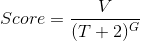
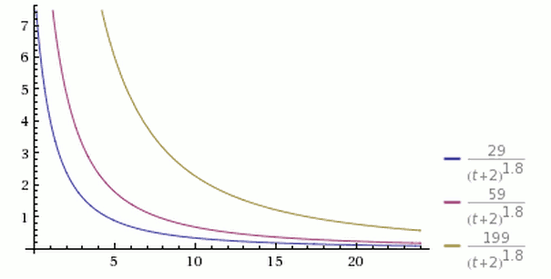
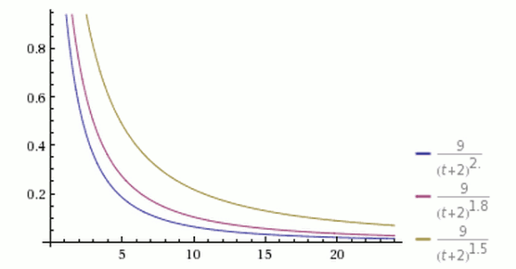
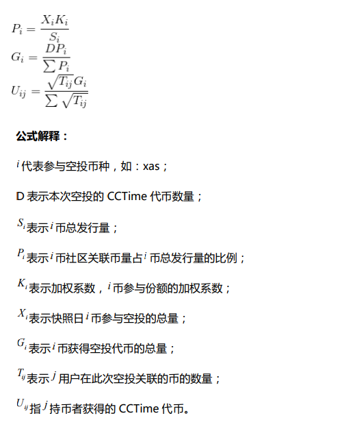

title:  CCTime白皮书
---
# 0 项目介绍

CCTime（Cryptocurrency Time）是基于阿希（Asch）侧链技术开发的
分布式社会新闻分享与交流平台。CCTime 在 Hacker News 的基础上进行重
构，使用区块链技术改变现有中心化的内容市场格局，解决优质内容难以识别、
传播和变现的问题，通过全新的内容价值评估体系保证优质内容的生产者直接
获得收益。通过“打赏模式”给予优质新闻发布者、分享者代币激励，构建一
个有价值且符合大众需求的新闻聚合和内容分享平台。

# 1 为什么要做 CCTime

## 1.1 思想起源

CCTime(Cryptocurrency Time)作为阿希应用的示范性案例，其创意来源
于 Hacker News。CCTime 仅包括账户注册与登录、新闻发布、浏览、评论、
投票等简单功能，设计的核心思想是不做内容原创，不做版权保护，不做社交，
只做内容分享与评论，使用区块链技术打造轻量级新闻聚合平台。

随着开发进度的加深，我们相信这个项目是具有深度发展潜力的，主要有
以下原因：

1. CCTime 的出现填补了以新闻分享和评论为主的区块链行业空白；

2. 币圈有一大批高水平的用户，但目前还没有一个像 Hacker News 这样高质量的社区把这群优质用户聚集起来，CCTime 是一个机会，币圈也需要这样一个产品；

3. 与传统新闻聚合平台相比，加入代币激励的功能，可以有效解决优质内容难以识别与变现的问题。基于区块链的 CCTime 旨在实现价值回归于价值创造者和传递者手里，让所有的参与者共同分享价值，而不是大部分收益由公司掌控；

4. YOYOW 、DECENT 、亿书更注重于内容原创与版权保护，CCTime 只是一个内容分享与评论的平台，属于新闻聚合类的平台，它的竞品应该是今日头条和 flipboard；

5. 与今日头条相比，CCTime 排名算法避免了机器学习算法带来的偏见深化问题，因为机器只会推荐你喜欢的内容；

6. CCTime 的功能简单易用，可以让用户迅速上手；

7. 在如今快速阅读膨胀的时代，新闻应用一直是一个强烈的需求，市场空间巨大。

## 1.2 运作模式

中心化的内容发布平台权力全部集中在中心机构，会导致中心化机构权力过大。完全去中心化的内容发布平台权力无法监管，可能会导致大量低俗、色情、反动等言论的自由传播。

CCTime（Cryptocurrency Time）的理念是传播价值信息。因此，为了减轻、避免，甚至杜绝完全去中心化所带来的负面影响，CCTime 系统采用多种方式结合的监管模式。

初期采用受托人作为监管者，受托人通过联合举报的方式来进行过滤，同时监管者的权利也会受到其他人的监督，避免权利的滥用。后期考虑采用“抵押
发文”的机制，每位发布者在发表信息的时候，通过抵押 XCT(时讯币）发文，系统将根据抵押发文进行排名，供阅读受众“点评”，当达到一定数量的星级时，
发布者便可通过赎回方式领回代币，也可以继续留给系统，作为下一次分享信息的“筹码”，通过 CCTime 系统的数据分析，抵押率会随之降低。

# 2 设计理念

## 2.1 简单易用

仅包括账户注册与登录、新闻发布、浏览、评论、投票等几个功能，不花费精力做社交、版权保护和原创内容，任何人都能够快速轻松使用。

## 2.2 监管合规

设置监管者角色，对不合规内容（色情、反动、暴力、凶杀等）进行审查。同时监管者也会受到所有人的监督，避免权利的滥用。

## 2.3 免费分发

代币全部进行免费分发，只 ICO,不进行融资，还原 ICO （Initial CryptoToken Offering）的本质,让更多的人可以免费持有代币。

## 2.4 价值共享

分布式价值传输，打破传统信息互联网的局限性，通过代币将产生的价值共享给所有的参与者，大家共同享受 CCTime 增值所带来的利润分配，有效的
促进内容发布者的积极性，促使更高质量的内容产生和传播。

# 3 技术细节

## 3.1 资产创生

CCTime 是基于 Asch 应用 sdk 开发的去中心化应用，与 Asch 主链可以互通资产。CCTime 应用内部不会发行代币，代币来自主链的转入。

我们会在 Asch 主链注册一个叫做 CCTime 的发行商，然后使用这个发行商注册一个名为 XCT(时讯币）的资产，这个资产的全称为 CCTime.XCT(时讯币）。

资产发行后会被一次性转入 CCTime 应用内部，并且被锁定在这个应用的一个联合签名账户内。

我们会在一年之内将 95%的代币免费发放给对这个应用感兴趣的用户。

为什么不在 CCTime 内部创生资产？

在主链发行资产的好处是，将来这些转入 Dapp 的资产还可以通过跨链接口转移到主链，然后再转到其他应用，以达到一币多链、一币多用的目的。

## 3.2 账户体系

Asch 主链与所有 Dapp 的账户是通用的（老版本的数字地址除外）。账户鉴权使用了非对称加密技术，因此不需要中心化的注册过程。用户只需保管一
个账户对应的主密码，就可以进行各种区块链的写入操作，比如转账、发布新闻、打赏、点赞、评论等。

主密码是使用 bip39 协议生成的由若干个(12 的倍数)单词组成的助记符，而公私钥对是以主密码为种子，通过 ed25519 椭圆曲线算法计算得到

账户 id 或账户地址则是由公钥通过两次 sha256 哈希以及一次 ripemd160 哈希再经过 base58check 进行编码获得。

## 3.3 密码学算法

区块 id 与交易 id 使用的是 sha256 hash 算法

区块的记账人签名与交易签名使用的是 ed25519 算法的 sodium 实现版

## 3.4 合约及抽象事务模型

Asch 应用使用了抽象事务模型，这个模型可以表达任意的函数调用。在比特币中，区块的 payload 是交易或转账记录，在 Asch 应用中，区块的 payload 就是函数或合约调用，也叫做事务(transaction)。

一个事务可以修改多个状态，比如余额、昵称、新闻、评论等，事务是原子性的，要么全部执行，要么全部撤销，不会出现执行一半的情况。CCTimeime 主要包括以下具体事务：

1. postArticle 发布文章(新闻)
2. postComment 发布评论
3. voteArticle 给文章投票
4. likeComment 打赏评论
5. report 举报文章或评论

## 3.5 新闻排名算法
CCTime 使用了如下的综合评分算法：

其中，
V 表示一篇文章获得的投票数，投票数以代币 XCT(时讯币）来计量
T 表示距离发布文章的时间(单位为小时)，加上 2 是考虑到一篇文章从创作出来
至分享到 CCTime 系统需要一定的时间，也避免了由于发布时间过短导致分母
太小的问题
G 是一个重力因子，它决定了文章排名下降的速度，CCTime 使用的默认值为1.8

从上图可以看到，有三个同时发表的帖子，得票分别为 199 票、59 票和 29 票，分别以黄色、紫色和蓝色表示。在任一个时间点上，都是黄色曲线在最上方，蓝色曲线在最下方。
在其他条件不变的情况下，越是新发表的帖子，排名越高。或者说，一个帖子的排名，会随着时间不断下降。
从上图可以看到，经过 24 小时之后，所有帖子的得分基本上都小于 1，这
意味着它们都将跌到排行榜的末尾，保证了排名前列的都将是较新的内容。

从上图可以看到，三根曲线的其他参数都一样，G 的值分别为 1.5、1.8 和 2.0。G 值越大，曲线越陡峭，排名下降得越快，意味着排行榜的更新速度越快。
(本节内容引用了阮一峰的博客， 并稍作修改 )

## 3.6 激励机制
每个事务的执行都需要消耗基础手续费，费用由发起人支付，并平均分配给所有记账人。

voteArticle 和 likeComment 两个事务除了基础手续费之外，发起人还需要选择支出额外的代币，用来代表投票及打赏的额度，这些额外支出的代币大部分都奖励给文章的发布者
或评论的发布者，但少部分(10%)会进入费用池分配给记账人。

## 3.7 审查机制
CCTime 是一个去中心化的系统，没有做用户身份认证，用户一般也是匿名登录，我们需要一个审查机制来防止反政府、反社会或其他违反法律的言论的出现。

CCTime1.0 的审查暂时由全体受托人来负责，每个受托人都可以举报任意一篇文章或评论，被举报次数超过 3 次的文章或评论将会过滤掉，但不会从底层数据库删除，仅仅是做一次标记。

审查机制影响的只是查询接口返回的数据，一个兼容 CCTime 协议的非标准节点仍然可以展示出所有非过滤的数据。

# 4 分发机制
XCT(时讯币）发行上限 100 亿。主创团队预留 5%代币，10%赠送给合作伙伴，其余 85%将全部空投给以币圈为主的社会各界人士，不进行融资，还原ICO （Initial Crypto-Token Offering）本质

## 4.1 分发原则

分发的原则是尽量覆盖更多的用户群体，但是以币圈内主，币圈外为次。对于币圈内采用资产证明（Proof of Asset）的方式。对于币圈外的社区，比如知乎，计划采用影响力证明的方式，但具体方案待定，方案将面向全社区征集。

## 4.2 币圈多社区分配公式（MCDF）

## 4.3 分期空投细则

### 4.3.1 首轮空投规则

1. 只针对币圈四个社区（阿希币，比特币，以太坊，比特股）；

2. 采用 5.2 节的多社区分配规则；

3. 8 月 20 号正式开始空投， 9 月 20 号对四大公有链进行快照，并按公式计算出用户应得份额后立即分发代币 ；

4. 分配总量 10 亿；

5. 示例说明请参考附录 A。

### 4.3.2 第二期以后

从第二期开始，持有 XCT(时讯币）可参与空投，除了指定币种外，每个XCT(时讯币）可领取 0.1 个 XCT(时讯币），其他币种以及空投比例，方案待定。

# 5 竞争优势

CCTime（Cryptocurrency Time）是基于阿希系统侧链的第一个 Dapp 应用(去中心化的内容分发平台)，相比于 Steem、Synereo、Decent、PressOne等其他平台拥有较大的优势，具体地：

1. 拥有阿希的技术支持和社区支持；
2. 产品模式创新，细分市场无竞争者；
3. 免费分发

# 6 风险提示

虽然 CCTime（Cryptocurrency Time）分发模式采用空投，但随着每轮空投，受众人数的增加， XCT(时讯币）难免会带来炒作（操作）风险的可能，包括但不局限：

1. 二级交易市场形成，线下交易活跃，风险大；

2. XCT(时讯币）一经分发，官方不再持有，持有者即为所有者， 密匙等应当妥善保存，一经丢失，官方不承担责任；

3. CCTime（Cryptocurrency Time）是基于阿希系统的一款分布式内容分享与交流平台的应用，作为一个平台应用，参与者应当遵守相关的法律法规，禁止一切不良、反动等言论，共同打造良好的环境氛围。

# 7 更多关注
阿希团队秉承区块链分享、贡献的理念，经过长时间的调研和开发，即将向国内区块链社区分享阿希生态的第一个应用，欢迎大家的使用，同时也欢迎广大的区块链开发者加入阿希社区，共同推进中国区块链应用落地。

CCTime（Cryptocurrency Time）即将与大家见面，更多资讯敬请关注：

CCTime 官网：www.cctime.org

ASCH 官网：www.asch.so

官方微博：北京阿希链科技有限公司

ASCH 官方微信公众号：

官方 QQ 群：

CCTime 官方 1 群：644658047

CCTime 官方 2 群：65622549

#8 附录Ａ：XCT(时讯币)首轮空投示例

举例：假如本轮参与阿希币的总量为 4000 万（Xxas）,阿希的加权系数为 2 阿希
币的总量按照 1 亿（Sxas）计算。
阿希币的比例：
Pxas=Xxas*Kxas/Sxas=4000 万*2/1 亿=0.8
假如本轮参与比特币的总量为 500 万（Xbtc）,比特币的加权系数为 1，比特币
的总量按照 2000 万（Sbtc）计算。
比特币的比例：
Pbtc=Xbtc*Kbtc/Sbtc=500 万*1/2000 万=0.25
假如本轮参与以太坊币的总量为 5000 万（Xeth）,以太坊币的加权系数为 1，以
太坊币的总量按照 1 亿（Seth）计算。
以太坊的比例：
Peth=Xeth*Keth/Seth=5000 万*1/1 亿=0.5
假如本轮参与比特股的总量为 10 亿（Xbts）,比特股的加权系数为 1，比特股的
总量按照 25 亿（Sbts）计算。
比特股的比例：
Pbts=Xbts*Kbts/Sbts=10 亿*1/25 亿=0.4
阿希币获得的空投总量：
Gxas=DPxas/Pxas+Pbtc+Peth+ Pbts=10 亿*0.8/（0.8+0.25+0.5+0.4）=4.10 亿
比特币获得的空投总量：
Gbtc=DPbtc/Pxas+Pbtc+Peth+ Pbts =10 亿*0.25/（0.8+0.25+0.5+0.4）=1.28 亿
以太币获得的空投总量：
Geth=DPeth/Pxas+Pbtc+Peth+ Pbts =10 亿*0.5/（0.8+0.25+0.5+0.4）=2.56 亿
比特股获得的空投总量：
Gbts=DPxas/Pxas+Pbtc+Peth+ Pbts=10 亿*0.4/（0.8+0.25+0.5+0.4）=2.05 亿
假如用户 j 持有百分之一（40 万）阿希币（Txasj），可以获得 CCTime 数量：
Uxasj=√40 万 ∗ 4.1 亿/∑√Txasj亿
假如用户 j 持有百分之一（5 万）比特币（Tbtcj），可以获得 CCTime 数量：
Ubtcj=√5 万 ∗ 1.28 亿/∑√Tbtcj亿
假如用户 j 持有百分之一（50 万）以太币（Tethj），可以获得 CCTime 数量：
Ubtcj=√50 万 ∗ 2.56 亿/∑√Tethj亿
假如用户 j 持有百分之一（1000 万）比特股（Tbtsj），可以获得 CCTime 数量：
Ubtcj=√1000 万 ∗ 2.05 亿/∑√Tbtsj亿